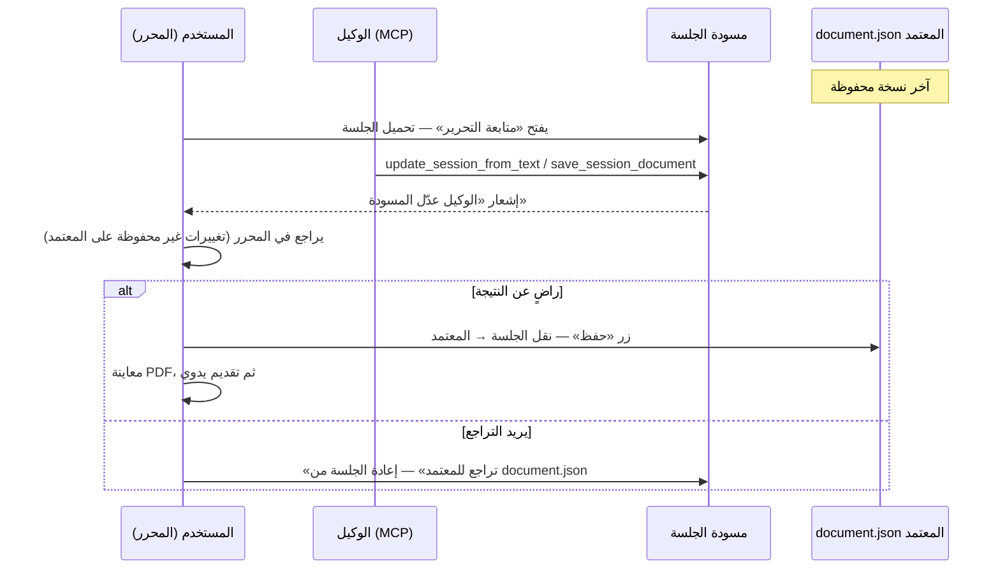

# أفكار ومخطط تطوير مشروع البيان

> **الغرض:** حفظ الأفكار والتحديثات المخططة للمشروع قبل تنفيذها. يُحدَّث هذا الملف تدريجياً مع كل مرحلة أو حدث تطوير جديد.

**آخر تحديث:** ٢٣ أغسطس ٢٠٢٦

---

## الفهرس

1. [حالة المشروع الحالية](#1-حالة-المشروع-الحالية)
2. [تقرير BuTeX — الاستخدام الحالي والمتطلبات لتحرير الكتب](#2-تقرير-butex--الاستخدام-الحالي-والمتطلبات-لتحرير-الكتب)
3. [قائمة فيديوهات التعليم (Tutorials)](#3-قائمة-فيديوهات-التعليم-tutorials)
4. [صفحة الإبلاغ عن المشاكل وآراء المستخدمين](#4-صفحة-الإبلاغ-عن-المشاكل-وآراء-المستخدمين)
5. [خادم MCP — التفاعل مع المنصة عبر الوكلاء الذكية](#5-خادم-mcp--التفاعل-مع-المنصة-عبر-الوكلاء-الذكية)

---

## 1. حالة المشروع الحالية

### النشر والوصول

- الحمد لله، المشروع **منشور على Railway** ومتاح للجميع عبر الإنترنت.
- المنصة **لم تصل بعد إلى نسختها النهائية** وما زالت **قيد التطوير**.

### ما يحتاج استكمالاً

| المجال | الوصف |
|--------|--------|
| **الصفحة الرئيسية** | بيانات تجريبية ثابتة (مقالات وهمية)، أزرار غير مربوطة، بحث واجهة فقط |
| **صفحات التحكم (مكتبي)** | بعض التدفقات تحتاج تحسيناً وتجربة مستخدم أوضح |
| **صفحات الإدارة** | تحتاج استكمالاً وربطاً أفضل مع سير العمل الفعلي |
| **عناصر مؤقتة (Placeholders)** | ISSN، DOI، أعداد تجريبية، روابط `#` — موزعة في الواجهة |

### أمثلة على البيانات التجريبية (الصفحة الرئيسية)

- قائمة `articles` ثابتة في `frontend/src/app/page.tsx` (٤ مقالات وهمية).
- تسمية «العدد الحالي · وضع تجريبي».
- «معرّف DOI · قيد الإسناد إن شاء الله».
- ISSN في لوحة البحث: `XXXX-XXXX` مع تسمية «قيد التسجيل» (`search-panel.tsx`).

### قرار مقصود: الإبقاء على بعض العناصر المؤقتة

- **لا مشكلة حالياً** في الإبقاء على عناصر مثل ISSN والبيانات التجريبية في الواجهة العامة.
- **الهدف القادم:** العمل على **إصدار مجلة رسمية** — سيكون جزءاً من المشروع أو الإصدار التالي المنشور لاحقاً بإذن الله.
- عند الإطلاق الرسمي: استبدال البيانات الوهمية ببيانات حقيقية من قاعدة البيانات، وإكمال التسجيلات (ISSN، DOI، إلخ).

### ملاحظة للمراحل القادمة

- يمكن إطلاق **حدث أو مرحلة تطوير جديدة** عند جاهزية مجموعة من التحديثات.
- بعد كل مرحلة: دفع التغييرات والتحديثات المتعلقة بالمشروع.

---

## 2. تقرير BuTeX — الاستخدام الحالي والمتطلبات لتحرير الكتب

> **الجمهور:** مدير حزمة `@drghaliasri/butex`  
> **الإصدار المستخدم حالياً:** `^5.6.1` (انظر `frontend/package.json`)

### 2.1 ملخص تنفيذي

منصة **البيان** تستخدم BuTeX اليوم لتحرير **مقالات علمية** كمستند واحد (`document.json`) يُصدَّر إلى LaTeX ثم يُجمَّع إلى PDF. نريد التوسع لاحقاً لتمكين المستخدم من تحرير **كتب كاملة أو أطروحات** — وهذا يختلف جوهرياً عن المقال: فصول منفصلة، تنقل بينها، حفظ مستقل، ثم معاينة/تجميع موحّد (مثل `main.tex` في LaTeX).

### 2.2 كيف نستعمل BuTeX حالياً

#### الواجهة (Next.js)

| المكوّن / الملف | الدور |
|-----------------|--------|
| `ButexDocumentEditor2` | المحرر الرئيسي — `@drghaliasri/butex/react-document2` |
| `DocumentFrozenPreview` | معاينة للمخطوطة المجمّدة (`previewOnly`) |
| `butex-latex.ts` | تصدير `document.json` → LaTeX عبر `document2Latex` |
| `butex-images.ts` | حل روابط الصور من S3 (`resolveImageUrl`) |
| `butex-mathjax.ts` | تهيئة MathJax + تسجيل حزمة BuTeX للمعادلات |
| `butex-theme.ts` | ربط ثيم المنصة (`albayan-butex-theme`) |

#### إعدادات المحرر الحالية (صفحة التحرير)

```tsx
<ButexDocumentEditor2
  uiLocale="ar"
  documentDirection="rtl"
  equationSide="arabic"
  mathOutput="svg"
  editableEquations
  resolveImageUrl={resolveImageUrl}
  onDocumentJsonChange={handleDocumentJsonChange}
/>
```

#### نموذج البيانات والتخزين

- **مصدر الحقيقة:** ملف واحد `document.json` لكل إصدار مقال.
- **التخزين:** S3 تحت `storage_prefix` لكل `article_version`:
  - `document.json` — مستند BuTeX Document v2
  - `assets/*` — صور المخطوطة
  - `compiled.pdf` — ناتج التجميع
  - `compile.log` — سجل الأخطاء عند الفشل
- **التصدير:** في المتصفح عبر `document2Latex(doc, { twocolumn: true })` — مناسب للمقالات، ليس للكتب.

#### سير العمل الحالي

1. المؤلف ينشئ مقالاً (عنوان + ملخص اختياري).
2. يفتح المحرر → يحرّر مستنداً **واحداً متصلاً**.
3. يحفظ → يُرفع `document.json` إلى S3.
4. عند التقديم تُجمَّد المسودة؛ يُطلَب تجميع PDF عبر worker خارجي.
5. المراجع/المحرر يعاين PDF أو معاينة BuTeX المجمّدة.

#### ما يعمل جيداً للمقالات

- محرر Document v2 مع دعم RTL والعربية.
- المعادلات (MathJax + `equationSide="arabic"`).
- إدراج الصور وربطها بمفاتيح `assets/uuid.ext`.
- تصدير LaTeX أحادي الملف للتجميع.
- معاينة مجمّدة بعد التقديم.

### 2.3 الفجوة: لماذا المقال ≠ الكتاب؟

| الجانب | المقال (الحالي) | الكتاب / الأطروحة (المطلوب) |
|--------|------------------|------------------------------|
| **هيكل المستند** | `document.json` واحد | فصول/أجزاء متعددة (مثل `\include{chapter1}`) |
| **واجهة التحرير** | صفحة واحدة طويلة | تنقل بين فصول — كل فصل صفحة/محرر مستقل |
| **الحفظ** | حفظ المستند كاملاً | حفظ فصل بفصل + حفظ البيانات الوصفية للكتاب |
| **التجميع LaTeX** | ملف `.tex` واحد | `main.tex` يجمع الفصول + front matter + back matter |
| **جدول المحتويات** | غير مطلوب عادة | **مطلوب** — ويُذكر أن BuTeX طوّر دعماً له |
| **المراجع** | قد تكون داخل المقال | **قائمة مراجع مركزية** — ويُذكر أن BuTeX طوّر دعماً لها |
| **خيارات التصدير** | `twocolumn: true` | عمود واحد، فصول، ترقيم، `\frontmatter`/`\mainmatter` |

### 2.4 ما نريد من BuTeX (طلبات للمطوّر)

#### أ) نموذج بيانات متعدد الفصول

- تمثيل **مشروع كتاب** (Book Project) يحتوي:
  - بيانات وصفية: عنوان، مؤلفون، لغة، اتجاه نص.
  - **فصول** مرتبة: كل فصل له `id`، عنوان، و`document.json` خاص (أو مرجع).
  - أقسام اختيارية: مقدمة، خاتمة، ملاحق.
  - **مراجع مشتركة** على مستوى الكتاب (وليس مكررة في كل فصل).
  - **جدول محتويات** يُولَّد من عناوين الفصول أو يُحرَّر يدوياً.
- صيغة تخزين واضحة (JSON schema) يمكن تقسيمها على S3:
  ```
  book/
    manifest.json      # فهرس الفصول والبيانات الوصفية
    chapters/
      ch01/document.json
      ch02/document.json
    references.json    # أو مدمج في manifest
  ```

#### ب) واجهة تحرير الكتاب

- **محرر فصل واحد** في كل مرة (نفس `ButexDocumentEditor2` أو متغيره) مع:
  - شريط تنقل بين الفصول (قائمة جانبية أو tabs).
  - حالة «غير محفوظ» **لكل فصل** على حدة.
  - إمكانية إضافة/حذف/إعادة ترتيب الفصول.
- **معاينة الكتاب كاملاً:** دمج الفصول للعرض أو للتصدير دون فقدان فصل العمل الحالي.
- دعم **Table of Contents** و**References** ككتل/أقسام BuTeX موجودة مسبقاً — نحتاج واجهة تحرير واضحة لها في سياق الكتاب.

#### ج) تصدير LaTeX متعدد الملفات

- `document2Latex` (أو API جديد مثل `book2Latex`) يُنتج:
  - `main.tex` مع `\documentclass{book}` أو قالب قابل للتخصيص.
  - ملفات `chapterNN.tex` منفصلة.
  - `\tableofcontents`، `\bibliography` أو ما يعادلها في BuTeX.
- خيارات تصدير منفصلة عن المقال: `{ twocolumn: false, documentClass: "book", ... }`.
- عقد واضح: كيف تُدمَج المراجع من الفصول في قائمة واحدة؟

#### د) التجميع (Compile)

- واجهة أو تنسيق يُرسل للمُجمِّع:
  - `main.tex` + جميع ملفات الفصول + الأصول.
  - أو أرشيف ZIP ببنية ثابتة.
- اليوم الخلفية تستقبل TeX + مفاتيح الصور لمقال واحد — نحتاج نفس الفكرة لمشروع متعدد الملفات.

#### هـ) التوافق مع الاستخدام الحالي

- الإبقاء على **Document v2 أحادي الملف** للمقالات دون كسر.
- نموذج الكتاب **طبقة إضافية** فوق Document v2، لا استبدالاً فجائياً.

### 2.5 ما يمكن أن ننفذه في المنصة (بعد دعم BuTeX)

- جداول قاعدة بيانات: `books` / `book_chapters` (أو تعميم `articles` — قرار لاحق).
- مسارات S3 منفصلة لكل فصل.
- صفحات: قائمة الكتب، محرر فصل، معاينة الكتاب، تقديم للتحكيم.
- worker تجميع يقبل بنية متعددة الملفات.

### 2.6 أسئلة مفتوحة لمدير الحزمة

1. هل Table of Contents و References في BuTeX جاهزان لسياق **كتاب متعدد الفصول** أم للمستند الواحد فقط؟
2. ما الصيغة الموصى بها لـ `manifest.json` للكتاب؟
3. هل يُفضَّل API تصدير جديد (`book2Latex`) أم توسيع `document2Latex` بخيارات؟
4. هل هناك مكوّن React مقترح لتنقل الفصول أم نبنيه نحن حول `ButexDocumentEditor2`؟
5. خارطة إصدارات متوقعة لدعم الكتاب؟

---

## 3. قائمة فيديوهات التعليم (Tutorials)

> **المبدأ:** فيديوهات **قصيرة جداً** (١–٣ دقائق لكل موضوع)، وليس دروساً طويلة.  
> **الموقع المقترح:** صفحة مخصصة (مثلاً `/al-durus` أو قسم في «إرشادات المؤلفين»).

### 3.1 التسجيل والدخول

| # | العنوان المقترح | المحتوى | المدة التقريبية |
|---|-----------------|---------|-----------------|
| 1 | إنشاء حساب والدخول إلى المنصة | التسجيل عبر Clerk، تأكيد البريد، تسجيل الدخول | ١:٣٠ |
| 2 | جولة سريعة في الواجهة العامة | الرئيسية، القوائم، إرشادات المؤلفين، التواصل | ٢:٠٠ |

### 3.2 مكتبي — المؤلف

| # | العنوان المقترح | المحتوى | المدة التقريبية |
|---|-----------------|---------|-----------------|
| 3 | ما هو «مكتبي»؟ | نظرة عامة، البطاقات (مسودات، قيد المراجعة، منشورة) | ١:٣٠ |
| 4 | إنشاء مقال جديد | عنوان، ملخص، الانتقال للمحرر | ١:٠٠ |
| 5 | التعرف على شريط أدوات المحرر | حفظ، رجوع، رفع صورة، تقديم | ١:٣٠ |
| 6 | كتابة النص وتنسيقه الأساسي | فقرات، عناوين، قوائم، اتجاه RTL | ٢:٠٠ |
| 7 | إدراج وتحرير المعادلات | فتح محرر المعادلات، معادلات عربية/لاتينية، المعاينة | ٢:٣٠ |
| 8 | إدراج الصور في المخطوطة | رفع صورة، تموضعها، الحفظ بعد الإدراج | ١:٣٠ |
| 9 | حفظ المسودة والتعامل مع «تغييرات غير محفوظة» | متى يُحفظ، تحذير المغادرة | ١:٠٠ |
| 10 | تقديم المقال للتحكيم | ماذا يحدث عند التقديم، تجميد المسودة | ١:٣٠ |
| 11 | متابعة حالة المقال بعد التقديم | الحالات (مُقدَّم، قيد المراجعة، مقبول، …) | ١:٣٠ |
| 12 | معاينة PDF المُجمَّع | فتح المعاينة، ماذا تفعل عند فشل التجميع | ١:٣٠ |

### 3.3 مكتبي — المراجع

| # | العنوان المقترح | المحتوى | المدة التقريبية |
|---|-----------------|---------|-----------------|
| 13 | استلام دعوة مراجعة | البريد/الإشعار، الدخول لمراجعاتي | ١:٠٠ |
| 14 | قراءة المخطوطة كمراجع | PDF، المعاينة، التعليقات | ٢:٠٠ |
| 15 | كتابة تقرير المراجعة والتوصية | التعليقات للمؤلف/المحرر، الحفظ والإرسال | ٢:٠٠ |

### 3.4 مكتبي — المحرر (تحريري)

| # | العنوان المقترح | المحتوى | المدة التقريبية |
|---|-----------------|---------|-----------------|
| 16 | لوحة التحرير — نظرة عامة | المقالات الواردة، الحالات | ١:٣٠ |
| 17 | إدارة مقال قيد التحرير | تعيين مراجعين، الملاحظات، الإصدارات | ٢:٣٠ |

### 3.5 الحساب والإعدادات

| # | العنوان المقترح | المحتوى | المدة التقريبية |
|---|-----------------|---------|-----------------|
| 18 | تحديث الملف الشخصي | الاسم، الجهة، السيرة | ١:٠٠ |
| 19 | تغيير كلمة المرور والأمان | إعدادات الأمان في Clerk | ١:٠٠ |

### 3.6 للمستقبل (بعد دعم الكتب)

| # | العنوان المقترح | المحتوى | المدة التقريبية |
|---|-----------------|---------|-----------------|
| 20 | إنشاء كتاب جديد والفصول | هيكل الكتاب، إضافة فصل | ٢:٠٠ |
| 21 | التنقل بين فصول الكتاب والحفظ | محرر الفصل، حفظ منفصل | ١:٣٠ |
| 22 | جدول المحتويات والمراجع في الكتاب | استخدام ميزات BuTeX للكتاب | ٢:٠٠ |
| 23 | معاينة وتجميع الكتاب كاملاً | PDF للكتاب المتعدد الفصول | ١:٣٠ |

### 3.7 توصيات إنتاج

- **اللغة:** عربية فصحى بسيطة، مع مصطلحات الواجهة كما تظهر للمستخدم.
- **التنسيق:** تسجيل شاشة + تعليق صوتي خفيف؛ أو نص على الشاشة فقط للفيديوهات الأقصر.
- **الدقة:** ١٠٨٠p كافٍ؛ التركيز على وضوح النص والمحرر.
- **التنظيم:** تجميع الفيديوهات في قوائم: «البداية»، «المؤلف»، «المراجع»، «المحرر».
- **العدد الإجمالي للمرحلة الأولى:** ١٩ فيديو (بدون قسم الكتب).

---

## 4. صفحة الإبلاغ عن المشاكل وآراء المستخدمين

### 4.1 الهدف

تمكين المستخدمين المسجّلين (أو الزوار — قرار لاحق) من **الإبلاغ عن مشكلة** واجهوها في المنصة، مع وصف نصي و**حتى ٣ صور** توضيحية، ليتمكن فريق التطوير من المعالجة وتحسين الواجهة.

### 4.2 المتطلبات الوظيفية

| المتطلب | التفاصيل |
|---------|-----------|
| **نموذج الإبلاغ** | عنوان مختصر، وصف المشكلة، نوع (خطأ / اقتراح تحسين / أخرى) |
| **المرفقات** | ٠–٣ صور (JPEG, PNG, WebP) — اختياري |
| **السياق التلقائي** | URL الصفحة، المتصفح، تاريخ/وقت (يُجمع تلقائياً) |
| **ربط المستخدم** | `user_id` من Clerk/PostgreSQL إن كان مسجّل الدخول |
| **حالة التقرير** | جديد → قيد المعالجة → مُغلق (مع رد اختياري من المطور) |
| **لوحة المطور** | قائمة التقارير في الإدارة أو أداة خارجية |

### 4.3 تأثير على قاعدة البيانات (مقترح)

```sql
-- جدول مقترح: user_feedback_reports
id              UUID PK
user_id         UUID FK → users.id (nullable للزوار إن سُمح)
type            enum: bug | suggestion | other
title           varchar(200)
description     text
page_url        varchar(500)
user_agent      text (nullable)
status          enum: new | in_progress | resolved | closed
developer_note  text (nullable)  -- رد داخلي أو للمستخدم
created_at      timestamptz
updated_at      timestamptz

-- جدول مقترح: user_feedback_attachments
id              UUID PK
report_id       UUID FK → user_feedback_reports.id
storage_key     varchar(500)   -- مثل feedback/{report_id}/{uuid}.png
mime_type       varchar(100)
size_bytes      integer
created_at      timestamptz
```

### 4.4 التخزين (S3)

- **بادئة مقترحة:** `feedback/{report_id}/` منفصلة عن `articles/...`
- **حد الحجم:** مثلاً ٥ م.ب لكل صورة، ٣ صور كحد أقصى.
- **الأمان:** روابط presigned للرفع؛ القراءة للمطورين/الإدارة فقط.
- **التنظيف:** سياسة احتفاظ عند حذف التقرير أو بعد إغلاقه (قرار لاحق).

### 4.5 واجهة المستخدم (مقترح)

- **مسار:** `/al-blagh` أو `/daea-mushkila` أو قسم في «التواصل».
- **نموذج بسيط:** عنوان، وصف، نوع، منطقة سحب للصور مع معاينة مصغرة.
- **تأكيد:** رسالة نجاح + رقم مرجعي للتقرير.
- **للمسجّل:** «تقاريري السابقة» (اختياري في مرحلة لاحقة).

### 4.6 API (مقترح)

| Method | المسار | الوصف |
|--------|--------|--------|
| `POST` | `/feedback` | إنشاء تقرير |
| `POST` | `/feedback/{id}/attachments` | رفع صورة (بعد إنشاء التقرير أو ضمن طلب متعدد الأجزاء) |
| `GET` | `/feedback/me` | تقارير المستخدم الحالي |
| `GET` | `/admin/feedback` | قائمة للإدارة (مع فلاتر) |
| `PATCH` | `/admin/feedback/{id}` | تحديث الحالة/ملاحظة المطور |

### 4.7 اعتبارات إضافية

- **الخصوصية:** عدم جمع بيانات حساسة في لقطات الشاشة؛ تنبيه المستخدم.
- **معدل الطلبات (Rate limiting):** منع الإساءة.
- **إشعار:** بريد للمطور عند تقرير جديد (اختياري).
- **العلاقة بصفحة التواصل الحالية:** `/al-tawasul` تبقى للاستفسارات العامة؛ الإبلاغ عن الأعطال صفحة منفصلة أو تبويب واضح.

### 4.8 مراحل التنفيذ المقترحة

1. **المرحلة ١:** جدول + API + نموذج بسيط بدون صور.
2. **المرحلة ٢:** رفع الصور إلى S3.
3. **المرحلة ٣:** لوحة إدارة + إشعارات.
4. **المرحلة ٤:** متابعة التقارير من قبل المستخدم.

---

## 5. خادم MCP — التفاعل مع المنصة عبر الوكلاء الذكية

> **الغرض:** تمكين مستخدمي المنصة من التفاعل مع «البيان» عبر وكلائهم الذكية (Cursor، Claude Desktop، وغيرهما) من خلال خادم **MCP** (Model Context Protocol).  
> **الحالة:** فكرة مخططة — لم يُنفَّذ بعد.  
> **تاريخ الدراسة:** ٢٢ أغسطس ٢٠٢٦

### 5.1 ملخص تنفيذي

منصة البيان لديها اليوم واجهة **Next.js** وخلفية **FastAPI** منظّمة جيداً (~٤٠ endpoint تحت `/api/v1/`)، مع مصادقة **Clerk** وأدوار (مؤلف، مراجع، محرر، مدير). هذا يجعلها **جاهزة تقنياً** لخادم MCP يغلّف الـ API الحالي دون إعادة بناء المنطق.

**قرار تصميم أساسي:** الاستعمال الرئيسي للوكلاء هو **الجلسة المشتركة** بين المستخدم (المستأجر/العميل) والوكيل — يعملان على **نفس مسودة الجلسة**؛ المستخدم يرى تغييرات الوكيل في سياق التحرير، يراجعها، يعدّل يدوياً، ثم **يحفظ ويعتمد** بنفسه. **التقديم** (مقال، مراجعة، قرار تحريري) يتم **يدوياً من المنصة فقط** — وليس عبر الوكيل.

**ما ينقص:** مسار مصادقة للوكلاء، خادم MCP منفصل، **طبقة مسودة الجلسة المشتركة** (`session/document.json`)، مزامنة المحرر مع الجلسة، طبقة تجريد نصية لـ BuTeX، ومنع صريح لأدوات التقديم/الإرسال من MCP.

### 5.2 كيف يعمل التطبيق اليوم (سياق للتصميم)

#### مخطط عام

```text
المتصفح (Next.js + BuTeX)
    ↓  Authorization: Bearer <Clerk JWT>
FastAPI (/api/v1/*)
    ↓
PostgreSQL + S3 (document.json, assets, PDF) + مترجم LaTeX خارجي
```

#### الطبقات الرئيسية

| الطبقة | التقنية | ملاحظة |
|--------|---------|--------|
| الواجهة | Next.js 15، Clerk | لا يوجد BFF — المتصفح يتصل مباشرة بـ FastAPI |
| الخلفية | FastAPI، SQLAlchemy، Alembic | خدمات: article, review, editor, admin, compile, invitation |
| المصادقة | Clerk JWT | `authenticate_request` + `authorized_parties` محددة |
| الأدوار | مزيج | **admin** من Clerk `publicMetadata.role`؛ author/reviewer/editor من جداول الربط |
| المحتوى | BuTeX `document.json` في S3 | مقال واحد = ملف JSON واحد لكل إصدار |
| سير العمل | draft → submitted → under_review → accepted/rejected → published | المسودة فقط قابلة للتحرير |

#### نقاط مهمة لـ MCP

- المنصة ليست CRUD بسيطاً: التحرير يمر عبر `document.json` (BuTeX Document v2).
- **اليوم:** صفحة التحرير تحتفظ بالتغييرات في **ذاكرة المتصفح** فقط (`dirty`) حتى زر «حفظ» — الوكيل لا يمكنه المشاركة في هذه الحالة.
- التقديم يتطلب تطابق العنوان/الملخص مع المستند + تجميع PDF ناجح (`compile_status=success`).
- الصلاحيات تُفرض في الخلفية؛ الوصول غير المصرّح يُرجع **404** (وليس 403) لإخفاء وجود المورد.
- المسودة المجمّدة (`status != draft`) ترفض أي تعديل (409).

### 5.3 فلسفة الاستعمال — ماذا يفعل الوكيل وماذا يفعل المستخدم؟

| الدور | الوكيل (MCP) | المستخدم (المنصة — يدوياً) |
|------|--------------|----------------------------|
| **مؤلف** | كتابة وتحرير **مسودة الجلسة** المشتركة؛ قراءة المقال؛ طلب تجميع PDF للمعاينة | فتح المحرر، **مراجعة** ما كتبه الوكيل، تعديل يدوي، **حفظ** المعتمد، **تقديم** المقال |
| **مراجع** | قراءة المخطوطة (PDF/مستند)؛ صياغة **مسودة** ملاحظات المراجعة | مراجعة الملاحظات في صفحة المراجعة، تعديل، **إرسال** التقرير والتوصية |
| **محرر** | قراءة المقال والمراجعات (لاحقاً — مساعدة في الصياغة) | **قرار تحريري** من واجهة «تحريري» فقط |
| **مدير** | قراءة وإحصاءات (لاحقاً) | تعيين مراجعين، تجاوز قرارات، إلخ — من `/admin` |

**مبدأ ثابت:** الوكيل **مساعد كتابة وتحرير** — وليس منفّذ قرارات نهائية (تقديم، إرسال مراجعة، قبول/رفض).

### 5.4 الجلسة المشتركة — التصميم المعتمد

#### المشكلة في التصميم الحالي

```text
S3: document.json          ← المعتمد (ما يُجمَّع ويُقدَّم)
        ↓ تحميل
صفحة التحرير (React)       ← تغييرات في الذاكرة فقط (dirty) — غير مرئية للوكيل
        ↓ زر «حفظ»
PUT /document              ← استبدال كامل لـ document.json
```

إذا كتب الوكيل مباشرة على `document.json` (كما يفعل `PUT` اليوم): لا مراجعة قبل الاعتماد، وتعارض محتمل مع محرر مفتوح بتغييرات غير محفوظة.

#### الحل المعتمد: مسودة جلسة مشتركة (Session Draft)

```text
document.json              ← المعتمد (canonical) — يُحدَّث فقط بزر «حفظ» من المستخدم
session/document.json      ← مسودة الجلسة — يكتب فيها الوكيل والمستخدم معاً
session/meta.json          ← (اختياري) آخر تعديل، المصدر (agent|user)، revision
```



**ما نعنيه بـ «جلسة مشتركة»:**

- **ليس** بالضرورة تحريراً متزامناً حرفاً بحرف (مثل Google Docs) في المرحلة الأولى.
- **نعني:** مسودة عمل **واحدة على الخادم** يراها المحرر والوكيل؛ التغييرات تظهر للمستخدم في صفحة التحرير قبل أي اعتماد على `document.json`.
- الوكيل **لا يكتب أبداً** مباشرة على `document.json` المعتمد.

#### قواعد الجلسة

| القاعدة | السبب |
|---------|--------|
| الوكيل يكتب في `session/` فقط | المعتمد لا يتغير حتى يحفظ المستخدم |
| المحرر يحمّل `session/` إن وُجدت، وإلا ينسخ من `document.json` عند أول فتح | بداية جلسة نظيفة |
| زر «حفظ» ينقل `session` → `document.json` | حد الاعتماد = قرار المستخدم |
| زر «تراجع للمعتمد» يستبدل `session` من `document.json` | رجوع بعد أخطاء الوكيل |
| snapshot اختياري قبل كل «حفظ» | `snapshots/{timestamp}.json` للرجوع لاحقاً |
| إن كان المحرر `dirty` ووصل تحديث من الوكيل | تنبيه: «الوكيل عدّل الجلسة — إعادة تحميل؟» (لا دمج صامت) |
| التقديم (`submit`) | **من الواجهة فقط** — لا أداة MCP |

#### تخزين S3 المقترح (تحت `storage_prefix`)

```text
articles/{id}/versions/v{n}/
  document.json           ← معتمد
  session/
    document.json         ← جلسة مشتركة
    meta.json             ← revision, updated_by, updated_at
  snapshots/              ← (اختياري) قبل كل حفظ
    2026-08-23T12-00-00Z.json
  assets/*
  compiled.pdf
```

#### مزامنة المحرر (واجهة)

| المرحلة | الآلية |
|---------|--------|
| **أولى** | polling كل N ثوانٍ أثناء فتح `/tahrir` — إن تغيّر `session/meta.revision` → banner «تحديث من الوكيل» |
| **لاحقة** | WebSocket أو SSE لإشعار فوري |

تمييز بصري اختياري: كتل أُضيفت من الوكيل بلون خفيف (يتطلب توسيع BuTeX أو metadata على الكتل).

#### المراجع — جلسة أبسط

مسودة المراجعة **موجودة أصلاً على الخادم** (`reviews` — `comments_to_author`، إلخ). الوكيل يحدّث **مسودة المراجعة** فقط؛ المستخدم يفتح صفحة المراجعة، يراجع، **يرسل يدوياً**. لا حاجة لطبقة `session/` منفصلة على مستند BuTeX للمراجع.

### 5.5 ما هو MCP في سياقنا؟

خادم MCP يعرض على الوكيل الذكي ثلاثة أنواع من الواجهات:

| النوع | الغرض | مثال في البيان |
|-------|--------|----------------|
| **Tools** | إجراءات يستدعيها الوكيل | `update_session_from_text`، `save_review_draft` |
| **Resources** | بيانات للقراءة عبر URI | `albayan://articles/{id}/session` |
| **Prompts** | قوالب جاهزة | «ساعدني في صياغة ملخص المقال» |

المستخدم يضيف خادم MCP في إعدادات وكيله، فيصبح الوكيل قادراً على التفاعل مع المنصة **نيابة عنه** — بشرط أن يكون **مصادقاً كمستخدم حقيقي** وبنفس صلاحياته. كل كتابة للمقال تذهب إلى **مسودة الجلسة** حتى يعتمدها المستخدم في المحرر.

### 5.6 التوصية المعمارية

#### خادم MCP منفصل + API جلسة في الخلفية

```text
mcp-server/                    ← بروتوكول MCP
    ↓ HTTP
backend FastAPI
    ├── /api/v1/articles/.../session   ← جديد: جلسة مشتركة
    ├── /api/v1/articles/.../document  ← معتمد (حفظ المستخدم فقط)
    └── ...
    ↓
PostgreSQL + S3 (document.json + session/ + snapshots/)
```

**لماذا منفصل وليس داخل FastAPI مباشرة؟**

- بروتوكول MCP (stdio / Streamable HTTP) مختلف عن REST.
- يمكن نشره على Railway كخدمة مستقلة.
- يعيد استخدام منطق الخدمات دون تكرار الصلاحيات.
- عزل أسهل: rate limiting، audit log، تعطيل MCP دون المساس بالواجهة.

#### ما لا ننصح به

1. فتح FastAPI بدون مصادقة للوكلاء.
2. إعطاء الوكيل وصول admin افتراضياً.
3. **`PUT /document` مباشرة من الوكيل** — يتجاوز مراجعة المستخدم.
4. أدوات `submit_article` / `submit_review` / `post_editor_decision` في MCP.
5. بناء MCP داخل Next.js (يجب أن يكون خدمة خلفية).
6. دمج صامت عند تعارض المحرر المحلي مع تحديث الوكيل.

### 5.7 المصادقة — مفاتيح وكيل شخصية (Personal Agent Tokens)

```text
المستخدم → صفحة في /al-idayat → «إنشاء مفتاح وكيل»
    ↓
يُنشأ token (يُعرض مرة واحدة) مرتبط بـ user_id + نطاق صلاحيات (scopes)
    ↓
المستخدم يضعه في إعدادات MCP client
    ↓
خادم MCP يتحقق منه ويمرّر Authorization إلى FastAPI
```

**جدول مقترح:**

```sql
agent_tokens
  id            UUID PK
  user_id       UUID FK → users.id
  token_hash    varchar(64)    -- SHA-256 للمفتاح؛ لا يُخزَّن النص الصريح
  label         varchar(100)   -- مثال: «Cursor على جهازي»
  scopes        text[]         -- انظر الجدول أدناه
  expires_at    timestamptz    -- nullable = بلا انتهاء (أو 90 يوماً افتراضياً)
  last_used_at  timestamptz
  revoked_at    timestamptz    -- nullable
  created_at    timestamptz
```

**النطاقات (scopes) المقترحة:**

| Scope | ماذا يسمح |
|-------|-----------|
| `profile:read` | قراءة الملف الشخصي |
| `articles:read` | قراءة مقالاتي، المعتمد، وجلسة التحرير |
| `articles:session:write` | كتابة **مسودة الجلسة** فقط (لا المعتمد) |
| `reviews:read` | قراءة تعيينات المراجعة والمخطوطة |
| `reviews:draft:write` | حفظ **مسودة** ملاحظات المراجعة (لا الإرسال) |
| `editor:read` | قراءة مقالات التحرير |
| `admin:read` | قراءة إدارية (لاحقاً) |

**ما لا يُمنح للوكيل (محظور بالتصميم — لا scope):**

| إجراء | السبب |
|-------|--------|
| `articles:submit` | التقديم يدوي من المنصة |
| `reviews:submit` | إرسال المراجعة يدوي |
| `editor:decision` | القرار التحريري يدوي |
| `admin:write` | إدارة المنصة يدوية |

**تعديل مطلوب في الخلفية (لاحقاً):**

- middleware يقبل إما Clerk JWT **أو** Agent Token.
- Agent Token يُحوَّل إلى `AuthContext` نفسه (`clerk_id` / `user_id`).
- التحقق من `scopes` قبل تنفيذ كل أداة MCP.
- endpoints الجلسة: `GET/PUT /articles/{id}/session` — الوكيل يستخدم PUT على الجلسة فقط.

#### لماذا ليس Clerk OAuth مباشرة في المرحلة الأولى؟

- OAuth 2.1 لـ MCP Remote موجود لكنه أعقد (authorization server، consent screen، token refresh).
- مفاتيح شخصية أبسط وأشبه بـ GitHub PAT — مناسبة لمرحلة تجريبية.
- يمكن إضافة OAuth لاحقاً للمستخدمين الذين لا يريدون نسخ مفاتيح يدوياً.

### 5.8 نقل البيانات (Transport)

| النمط | مناسب لـ | ملاحظة |
|-------|----------|--------|
| **stdio** | Cursor محلي، تطوير | المستخدم يشغّل الخادم على جهازه؛ الـ token في متغير بيئة |
| **Streamable HTTP** | إنتاج على Railway | المستخدمون يضيفون URL في إعدادات الوكيل |
| **SSE** | بديل قديم | MCP يتجه نحو HTTP |

**للإنتاج على Railway:** Streamable HTTP على مسار مثل `https://mcp.albayan-journal.org/mcp` مع HTTPS إلزامي.

**مثال إعداد في Cursor (محلي):**

```json
{
  "mcpServers": {
    "albayan": {
      "command": "python",
      "args": ["-m", "albayan_mcp"],
      "env": {
        "ALBAYAN_API_URL": "https://api.albayan-journal.org",
        "ALBAYAN_AGENT_TOKEN": "alb_xxxxxxxx"
      }
    }
  }
}
```

**مثال إعداد عن بُعد (إنتاج):**

```json
{
  "mcpServers": {
    "albayan": {
      "url": "https://mcp.albayan-journal.org/mcp",
      "headers": {
        "Authorization": "Bearer alb_xxxxxxxx"
      }
    }
  }
}
```

### 5.9 تصميم الأدوات (Tools) — مبني على الجلسة المشتركة

#### API جلسة جديد (خلفية — للمحرر والوكيل)

| Method | المسار | من يستخدمه | الوصف |
|--------|--------|------------|--------|
| `GET` | `/articles/{id}/session` | محرر + وكيل | قراءة مسودة الجلسة |
| `PUT` | `/articles/{id}/session` | وكيل (MCP) + محرر | تحديث مسودة الجلسة |
| `DELETE` | `/articles/{id}/session` | محرر (المستخدم) | تراجع — إعادة الجلسة من المعتمد |
| `POST` | `/articles/{id}/session/commit` | محرر (المستخدم فقط) | نقل الجلسة → `document.json` (= زر «حفظ») |
| `GET` | `/articles/{id}/session/meta` | محرر (polling) | `revision`، `updated_by`، `updated_at` |

`PUT /articles/{id}/document` يبقى **للمستخدم عبر المحرر** عند الاعتماد (أو يُستبدل بـ `session/commit`).

#### المرحلة 1 — قراءة

| Tool | يستدعي | الغرض |
|------|--------|--------|
| `get_my_profile` | `GET /users/me` | معلومات الحساب |
| `list_my_articles` | `GET /articles/me` | قائمة المقالات |
| `get_article` | `GET /articles/{id}` | تفاصيل + حالة |
| `get_article_document` | `GET /articles/{id}/document` | المحتوى **المعتمد** |
| `get_session_document` | `GET /articles/{id}/session` | مسودة **الجلسة** الحالية |
| `get_session_as_text` | تحويل محلي | نص الجلسة للوكيل |
| `list_my_reviews` | `GET /reviews/me` | تعيينات المراجعة |
| `get_review_assignment` | `GET /reviews/assignments/{id}` | تفاصيل تعيين |

#### المرحلة 2 — كتابة الجلسة (مؤلف)

| Tool | يستدعي | ملاحظة |
|------|--------|--------|
| `create_article` | `POST /articles` | إنشاء مقال + تهيئة جلسة فارغة |
| `update_article_metadata` | `PATCH /articles/{id}` | عنوان/ملخص — مسودة فقط |
| `update_session_from_text` | تحويل + `PUT /session` | **الأداة الرئيسية للكتابة** |
| `save_session_document` | `PUT /session` | JSON كامل — للمطورين بحذر |
| `upload_article_image` | `POST /assets` | صور تُستخدم في الجلسة |
| `request_compile` | `POST /compile` | يُجمّع من **المعتمد**؛ يذكّر المستخدم بالحفظ أولاً إن تغيّرت الجلسة |

**لا يوجد في MCP:** `submit_article`، `commit_session` (الاعتماد = حفظ المستخدم في المحرر).

#### المرحلة 3 — مراجع

| Tool | يستدعي | ملاحظة |
|------|--------|--------|
| `get_assignment_document` / PDF | قراءة | للمخطوطة |
| `save_review_draft` | `PUT .../review` | مسودة ملاحظات فقط |
| **محظور** | `POST .../review/submit` | الإرسال يدوي من المنصة |

#### ما لن يُضاف إلى MCP (قرار ثابت)

| إجراء | البديل |
|-------|--------|
| تقديم مقال | المستخدم: زر «تقديم» في `/maktabi/maqalati/{id}` |
| إرسال مراجعة | المستخدم: زر «إرسال» في `/maktabi/murajaati/{id}` |
| قرار تحريري | المستخدم: `/maktabi/tahriri/{id}` |
| إدارة admin | `/admin` فقط |

### 5.10 تحرير المحتوى — طبقة نصية على الجلسة

BuTeX Document v2 JSON معقد. الوكيل يتعامل مع **الجلسة** عبر نص مبسّط:

```text
get_session_as_text(article_id)       → قراءة ما في الجلسة
update_session_from_text(article_id, section?, text)  → كتابة في الجلسة
```

| مسار | الاستعمال |
|------|-----------|
| **نصي على الجلسة** | المسار الافتراضي للمؤلفين — يظهر في المحرر بعد المزامنة |
| **أدوات كتل** (`insert_paragraph`, …) | لاحقاً — تعديلات موضعية أدق |
| **JSON خام على الجلسة** | `save_session_document` — dev فقط |

**الفرق عن التصميم السابق:** كل الكتابة تستهدف `session/` — **ليس** `document.json` المعتمد.

### 5.11 Resources (للقراءة السريعة)

```
albayan://profile
albayan://articles
albayan://articles/{id}
albayan://articles/{id}/document          ← معتمد
albayan://articles/{id}/session           ← جلسة مشتركة
albayan://articles/{id}/session/meta      ← revision للمزامنة
albayan://articles/{id}/status
albayan://reviews/assignments/{id}
```

### 5.12 Prompts مفيدة (قوالب جاهزة)

| Prompt | الغرض |
|--------|--------|
| `draft-abstract` | صياغة ملخص (يُكتب في الجلسة أو metadata) |
| `continue-session` | متابعة الكتابة من `get_session_as_text` |
| `review-checklist` | قائمة تحقق للمراجع |
| `status-summary` | ملخص حالة مقالاتي |
| `remind-save` | تذكير المستخدم بالحفظ قبل التجميع/التقديم |

### 5.13 الأمان

| المخاطرة | الحل |
|----------|------|
| الوكيل يعتمد محتوى دون المستخدم | **لا** `commit` / `submit` من MCP؛ الجلسة ≠ المعتمد |
| تعارض محرر + وكيل | polling + تنبيه؛ لا دمج صامت |
| الوكيل يفسد JSON | الكتابة على الجلسة + «تراجع للمعتمد» |
| تسريب مسودة | سياسة 404 الحالية |
| token مسروق | انتهاء، إلغاء، scopes ضيقة (`session:write` لا `commit`) |
| إساءة استخدام | rate limit + audit log |
| رفع صور | نفس قيود MIME والحجم (٥ م.ب) |

**جدول audit log مقترح:**

```sql
mcp_audit_log
  id          UUID PK
  user_id     UUID FK → users.id
  token_id    UUID FK → agent_tokens.id (nullable)
  tool_name   varchar(100)
  target      varchar(50)     -- session | review_draft | ...
  args_hash   varchar(64)
  status      varchar(20)
  error_code  integer (nullable)
  ip_address  inet (nullable)
  created_at  timestamptz
```

### 5.14 هيكل مشروع MCP مقترح

```text
mcp-server/
└── src/albayan_mcp/
    ├── tools/
    │   ├── session.py          ← update_session_from_text، get_session_*
    │   ├── articles.py
    │   └── reviews.py
    ├── converters/
    │   └── document_text.py    # يعمل على جلسة، ليس معتمداً
    └── ...
```

**تعديلات الواجهة (frontend) المطلوبة:**

- `/tahrir`: تحميل من `/session`؛ polling على `/session/meta`.
- banner «الوكيل عدّل المسودة — إعادة تحميل؟».
- زر «حفظ» → `POST .../session/commit`.
- زر «تراجع للمعتمد» → `DELETE .../session`.

### 5.15 تجربة المستخدم — سيناريو الجلسة المشتركة

```text
1. المستخدم ينشئ مفتاح وكيل في /al-idayat ويضيفه في Cursor
2. يفتح مقالاً → «متابعة التحرير» (اختياري — يمكن أن يبدأ الوكيل أولاً)
3. في Cursor: «اكتب مقدمة للمقال X»
4. الوكيل: get_session_as_text → update_session_from_text → PUT /session
5. في المحرر (أو عند فتحه): «الوكيل عدّل المسودة» — يرى النص، يعدّل يدوياً
6. إن أخطأ الوكيل: «تراجع للمعتمد»
7. إن رضي: «حفظ» → session → document.json المعتمد
8. معاينة PDF، ثم «تقديم» يدوياً من صفحة المقال — ليس عبر الوكيل
```

**مراجع:** يقرأ الوكيل المخطوطة، يكتب `save_review_draft`؛ المستخدم يفتح مراجعاتي، يراجع، **يرسل** يدوياً.

### 5.16 ربط بـ API الحالي

| الدور | مسارات | عبر MCP |
|-------|--------|---------|
| مؤلف | `/articles/*/session`، `/document` (قراءة معتمد) | كتابة جلسة فقط |
| مراجع | `/reviews/*` | مسودة مراجعة فقط |
| محرر/مدير | قراءة لاحقاً | بدون قرارات من MCP |

### 5.17 خارطة تنفيذ مقترحة

| المرحلة | المحتوى |
|---------|---------|
| **0** | `agent_tokens` + middleware |
| **1** | API الجلسة (`session/`) + تعديل المحرر (تحميل، commit، تراجع، polling) |
| **2** | MCP read-only + `get_session_*` |
| **3** | `update_session_from_text` + محوّل BuTeX ↔ نص |
| **4** | `save_review_draft` للمراجع |
| **5** | WebSocket/SSE + تمييز بصري لكتل الوكيل (اختياري) |
| **6** | OAuth 2.1 (اختياري) |

### 5.18 أسئلة مفتوحة

1. فترة polling الافتراضية في المحرر (٣ ث؟ ٥ ث؟).
2. هل `request_compile` يُجمّع من الجلسة مباشرة (معاينة قبل الحفظ) أم من المعتمد فقط؟
3. حد أقصى لحجم `session/document.json` أو عدد revisions؟
4. واجهة محادثة داخل المنصة تستخدم نفس API الجلسة؟
5. snapshots تلقائية قبل كل commit — كم نسخة نحتفظ؟

### 5.19 الخلاصة

| جاهز اليوم | ينقص (مع الجلسة المشتركة) |
|------------|---------------------------|
| API مقالات ومراجع | طبقة `session/` في S3 + endpoints |
| محرر BuTeX | مزامنة مع الجلسة + commit/تراجع |
| مسودة مراجعة على الخادم | ربط MCP بـ `save_review_draft` فقط |
| | Agent tokens + MCP server |
| | منع submit من الوكيل (تصميم، ليس فقط policy) |

**القرار المعتمد:** الجلسة المشتركة (مسودة جلسة على الخادم) هي نموذج التحرير الأساسي بين المستخدم والوكيل؛ الاعتماد والتقديم يبقيان في يد المستخدم على المنصة.

---

## سجل التحديثات

| التاريخ | التحديث |
|---------|---------|
| ٢١/٠٨/٢٠٢٦ | إنشاء الملف: حالة المشروع، تقرير BuTeX، قائمة الفيديوهات، صفحة الإبلاغ |
| ٢٢/٠٨/٢٠٢٦ | إضافة القسم ٥: خادم MCP — التفاعل مع المنصة عبر الوكلاء الذكية |
| ٢٣/٠٨/٢٠٢٦ | تحديث القسم ٥: اعتماد **الجلسة المشتركة** (session draft) كنموذج التحرير الأساسي؛ منع التقديم/الإرسال من MCP |

---

*يُضاف إلى هذا الملف عند الحاجة — دون حذف السياق التاريخي للقرارات.*
