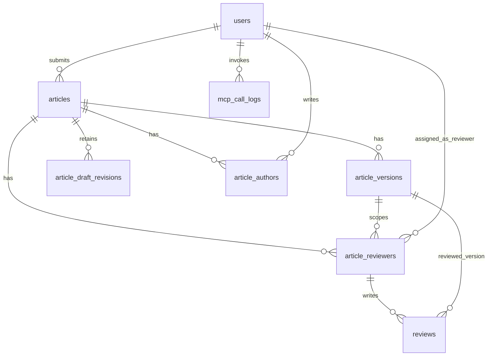

# مخطط قاعدة بيانات مجلة البيان

المرجع الرئيسي لتصميم قاعدة البيانات في منصة **البيان** — إدارة المقالات العلمية، الإصدارات، التأليف، والتحكيم.

---

## 1. مقدمة

المنصة تدير دورة حياة المقال العلمي من المسودة حتى النشر. المستخدمون يُعرَّفون عبر Clerk ويُخزَّن ملفهم في PostgreSQL. المقالات لها إصدارات رسمية متعددة، وكل تعيين مراجع ودعوة مراجعة مثبتان على إصدار رسمي بعينه.

**نطاق هذا المستند:** مخطط المقالات الحالي، بما فيه مراجعات المسودة غير القابلة للتعديل والإصدارات الرسمية.

---

## 2. قرارات التصميم

| # | القرار |
|---|--------|
| 1 | **لا `roles` / `user_roles`** — الإدارة عبر `users.is_admin` في البداية |
| 2 | **`articles` ≠ النسخة** — حالة سير العمل على `articles`، والإصدارات الرسمية في `article_versions` |
| 3 | **المسودة ليست إصداراً** — `current_draft_revision_id` يشير إلى لقطة غير قابلة للتعديل |
| 4 | **المؤلفون** في `article_authors` مع `author_order` و`is_corresponding` |
| 5 | **المراجعون** في `article_reviewers` — تعيين مستقل لكل جولة/نسخة رسمية |
| 6 | **نص المراجعة** في `reviews` منفصل عن `article_reviewers` |
| 7 | **`reviews.article_reviewer_id`** → `article_reviewers.id` (وليس مباشرة إلى `users`) |
| 8 | **`reviews.article_version_id`** — المراجعة مرتبطة بنسخة محددة |
| 9 | **ملفات المسودة** — لكل مراجعة مفتاح S3 فريد لـ `document.json` |
| 10 | **العنوان والملخص** — متزامنان بين `Article` ومراجعة Document2 الحالية |
| 11 | **Worker** — حالة المعاينة مرتبطة بمراجعة المسودة الدقيقة |
| 12 | **المستخدم مؤلف/مراجع** فقط عند وجوده في جداول الربط المناسبة |
| 13 | **حالة سير المخطوطة** على `articles.status`؛ `ArticleVersion` لقطة رسمية فقط |
| 14 | **طلب التعديل** يفتح DraftRevision جديدة من أحدث نسخة رسمية، ولا يغيّر النسخة أو تقاريرها |
| 15 | **إعادة التقديم** تنشئ v2+ ولا تنسخ تعيينات المراجعين تلقائياً |

---

## 3. مخطط العلاقات (ER)



**مسار بيانات المراجعة:**

```text
reviews → article_reviewers → users
reviews → article_versions → articles
```

---

## 4. الجداول

### 4.1 `users`

الأشخاص المسجّلون (مزامنة مع Clerk).

| العمود | النوع | ملاحظات |
|--------|--------|---------|
| `id` | UUID PK | |
| `clerk_id` | string, unique | معرّف Clerk |
| `email` | string | |
| `full_name` | string, nullable | |
| `affiliation` | string, nullable | الجهة/الجامعة |
| `bio` | text, nullable | |
| `is_admin` | boolean | default `false` — صلاحيات إدارية بسيطة |
| `created_at` | timestamptz | |
| `updated_at` | timestamptz | |

**فهارس:** `ix_users_clerk_id` (unique), `ix_users_email`

---

### 4.2 `articles`

حاوية المقال ومصدر حالة سير العمل ومؤشر المسودة الحالية.

| العمود | النوع | ملاحظات |
|--------|--------|---------|
| `id` | UUID PK | |
| `submitted_by` | UUID FK → `users.id` | RESTRICT |
| `title` | string(500) | |
| `abstract` | text, nullable | |
| `status` | enum | `draft` … `published` |
| `current_draft_revision_id` | UUID, nullable | مراجعة المسودة الحالية |
| `draft_revision_number` | integer | عداد المراجعة الحالية |
| `revision_request_note` | text, nullable | أحدث توجيه تعديل فقط |
| `revision_requested_for_version_id` | UUID, nullable | النسخة الرسمية التي طُلب تعديلها |
| `revision_requested_by` | UUID, nullable | المحرر/المدير الذي طلب التعديل |
| `revision_requested_at` | timestamptz, nullable | وقت أحدث طلب تعديل |
| `created_at` | timestamptz | |
| `updated_at` | timestamptz | |

**فهارس:** `ix_articles_submitted_by`

---

### 4.3 `article_versions`

نسخ المقال (v1 بعد التقديم، v2 بعد التعديل، …).

| العمود | النوع | ملاحظات |
|--------|--------|---------|
| `id` | UUID PK | |
| `article_id` | UUID FK → `articles.id` | CASCADE |
| `version_number` | integer | 1, 2, 3… |
| `storage_prefix` | string(500) | بادئة S3، مثال: `articles/{id}/versions/v1/` |
| `source_type` | enum | `zip_upload` \| `web_editor` (افتراضي: `web_editor`) |
| `source_draft_revision_id` | UUID | مراجعة المسودة التي أنتجت الإصدار |
| `document_hash` | string(64) | بصمة المستند الرسمي |
| `title_snapshot` | string(500) | العنوان وقت التقديم |
| `abstract_snapshot` | text, nullable | الملخص وقت التقديم |
| `submitted_at` | timestamptz, nullable | تاريخ تقديم هذه النسخة |
| `created_at` | timestamptz | |

**قيود:** UNIQUE `(article_id, version_number)`

**فهارس:** `ix_article_versions_article_id`

**النسخة الحالية** (مصدر الحقيقة لموقع المخطوطة):

```sql
SELECT * FROM article_versions
WHERE article_id = :article_id
ORDER BY version_number DESC
LIMIT 1;
```

**عند التقديم:** تُنشأ v1 من مراجعة المسودة الحالية. وعند إعادة التقديم من `revision_requested` تُنشأ v2+ بالطريقة نفسها، ثم تتحول `Article.status` إلى `submitted`.

### 4.3.1 `article_draft_revisions`

لقطات Document2 غير قابلة للتعديل، محتفظ بآخر 100 لقطة منها.

| العمود | الغرض |
|--------|-------|
| `revision_number`, `storage_key`, `document_hash` | هوية اللقطة وموضعها الفريد |
| `created_by`, `actor_type`, `reason` | provenance التعديل |
| `restored_from_id`, `restored_from_revision_number` | مصدر الاستعادة، ويبقى الرقم بعد pruning |
| `referenced_asset_ids` | أصول الصور المحمية لهذه اللقطة |
| حقول التجميع | آخر محاولة معاينة لهذه اللقطة فقط |

يمنع trigger تعديل حقول اللقطة وprovenance، ويسمح فقط بتحديث حالة التجميع.

---

### 4.4 `article_authors`

ربط many-to-many بين المقالات والمؤلفين.

| العمود | النوع | ملاحظات |
|--------|--------|---------|
| `article_id` | UUID FK → `articles.id` | CASCADE — جزء من PK |
| `user_id` | UUID FK → `users.id` | CASCADE — جزء من PK |
| `author_order` | integer | ترتيب الظهور (1 = الأول) |
| `is_corresponding` | boolean | المؤلف المراسل |

**PK:** `(article_id, user_id)`

---

### 4.5 `article_reviewers`

تعيين مراجع لنسخة رسمية بعينها وحالة المهمة.

| العمود | النوع | ملاحظات |
|--------|--------|---------|
| `id` | UUID PK | مطلوب لربط `reviews` |
| `article_id` | UUID FK → `articles.id` | CASCADE |
| `article_version_id` | UUID | النسخة الدقيقة، ويجب أن تنتمي إلى المقال نفسه |
| `user_id` | UUID FK → `users.id` | RESTRICT |
| `status` | enum | `invited` \| `accepted` \| `declined` \| `completed` |
| `invited_at` | timestamptz | |
| `accepted_at` | timestamptz, nullable | |
| `declined_at` | timestamptz, nullable | |
| `created_at` | timestamptz | |
| `updated_at` | timestamptz | |

**قيود:** UNIQUE `(article_version_id, user_id)`؛ وقيد مركب يضمن تطابق المقال والنسخة. يمكن تعيين الشخص نفسه مرة أخرى على v2.

**فهارس:** `ix_article_reviewers_article_id`, `ix_article_reviewers_user_id`

---

### 4.6 `reviews`

نص المراجعة وتوصيتها — مرتبط بتعيين مراجع **ونسخة محددة**.

| العمود | النوع | ملاحظات |
|--------|--------|---------|
| `id` | UUID PK | |
| `article_reviewer_id` | UUID FK → `article_reviewers.id` | CASCADE |
| `article_version_id` | UUID FK → `article_versions.id` | RESTRICT |
| `comments_to_author` | text, nullable | ملاحظات للمؤلف |
| `comments_to_editor` | text, nullable | ملاحظات سرية للمحرر |
| `recommendation` | enum, nullable | `accept` \| `minor_revision` \| `major_revision` \| `reject` |
| `status` | enum | `draft` \| `submitted` |
| `reveal_reviewer_identity_to_author` | boolean | افتراضياً `false`، ويختاره المحرر لكل تقرير عند طلب التعديلات |
| `submitted_at` | timestamptz, nullable | |
| `created_at` | timestamptz | |
| `updated_at` | timestamptz | |

**قيود:** تقرير واحد لكل `(article_reviewer_id, article_version_id)`، والنسخة يجب أن تطابق نسخة التعيين.

**فهارس:** `ix_reviews_article_reviewer_id`, `ix_reviews_article_version_id`

### 4.7 `invitations`

دعوة المراجع تحمل `article_version_id` إلزامياً وتبقى مثبتة على الجولة التي
أُنشئت فيها. دعوة المحرر لا تحمل نسخة. إذا انتهت الجولة أو أصبحت نسخة أحدث هي
الحالية، تُرفض دعوة المراجع القديمة بأمان.

### 4.8 `mcp_call_logs`

سجل تشغيلي منقّح لاستدعاءات أدوات MCP الفعلية، وليس لطلبات FastAPI المباشرة.

| العمود | النوع | ملاحظات |
|--------|--------|---------|
| `id` | UUID PK | يملكه الخادم |
| `created_at` | timestamptz | يملكه الخادم |
| `user_id` | UUID FK → `users.id`, nullable | `ON DELETE SET NULL` |
| `trace_id` | varchar(32), nullable | معرّف OpenTelemetry للربط المستقبلي |
| `tool_name` | varchar(100) | اسم أداة MCP |
| `command_name` | varchar(100), nullable | قيمة `arguments.command.op` إن وُجدت |
| `status` | varchar(16) | `success` أو `error` |
| `duration_ms` | integer | غير سالب |
| `input` | JSONB | لقطة منقّحة بحد 32 KiB |
| `output` | JSONB, nullable | لقطة نجاح منقّحة بحد 64 KiB |
| `error` | text, nullable | رسالة آمنة بحد 2000 محرف |

**الفهارس:** `created_at`، و`(tool_name, created_at)`، و
`(command_name, created_at)`، و`(status, created_at)`، و
`(user_id, created_at)`.

مدة الاحتفاظ 90 يوماً، وتنفذها المهمة اليومية
`python -m app.jobs.cleanup_mcp_logs`. تبقى أسماء الأدوات والأوامر نصوصاً حرة
حتى تظهر القدرات الجديدة في التحليلات بلا تعديل للمخطط.

---

## 5. التعدادات (Enums)

### `ArticleStatus` — حالة سير المخطوطة

| القيمة | المعنى |
|--------|--------|
| `draft` | مسودة — قابلة للتحرير |
| `submitted` | مُقدَّم — مجمّدة |
| `under_review` | قيد المراجعة |
| `revision_requested` | مطلوب تعديل — المسودة قابلة للتحرير والحفظ والتجميع والاستعادة |
| `accepted` | مقبول |
| `rejected` | مرفوض |
| `published` | منشور |

### `ReviewerAssignmentStatus` — حالة تعيين المراجع

| القيمة | المعنى |
|--------|--------|
| `invited` | دُعي |
| `accepted` | قبل المراجعة |
| `declined` | رفض الدعوة |
| `completed` | أنهى المراجعة |

### `SourceType` — مصدر النسخة

| القيمة | المعنى |
|--------|--------|
| `zip_upload` | رفع ملف ZIP (لاحقاً) |
| `web_editor` | محرر BuTeX داخل الموقع — **المسار الافتراضي v1** |

### `CompileStatus` — حالة تجميع PDF

| القيمة | المعنى |
|--------|--------|
| `pending` | في الانتظار |
| `processing` | قيد المعالجة |
| `success` | نجح التجميع |
| `failed` | فشل التجميع |

### `ReviewRecommendation` — توصية المراجع

| القيمة | المعنى |
|--------|--------|
| `accept` | قبول |
| `minor_revision` | تعديلات طفيفة |
| `major_revision` | تعديلات جوهرية |
| `reject` | رفض |

### `ReviewStatus` — حالة تقرير المراجعة

| القيمة | المعنى |
|--------|--------|
| `draft` | مسودة |
| `submitted` | مُسلَّم |

---

## 6. سيناريوهات شائعة

### إنشاء مقال جديد

```text
1. INSERT INTO articles (submitted_by, title, abstract, status='draft')
2. INSERT INTO article_draft_revisions (..., revision_number=1, reason='initial')
3. INSERT INTO article_authors (article_id, user_id, author_order=1, is_corresponding=true)
4. لا يُنشأ أي `article_versions` قبل التقديم.
```

بدون `UPDATE` إضافي وبدون علاقة دائرية.

### طلب تعديلات ثم إعادة التقديم

```text
1. يقفل المحرر المقال ويثبت الطلب على أحدث `article_version`.
2. ينسخ المستند الرسمي وأصوله إلى مساحة المسودة.
3. ينشئ DraftRevision جديدة `reason='revision_request'` ويضبط الحالة `revision_requested`.
4. بعد تعديل المؤلف ومعاينة المراجعة الدقيقة، ينشئ التقديم `versions/vN` غير قابلة للتعديل ويعيد الحالة إلى `submitted`.
5. لا تُنشأ تعيينات مراجعين للجولة الجديدة تلقائياً.
```

### تقديم إصدار

```text
INSERT INTO article_versions (..., version_number=:next_number, ...);
UPDATE articles SET status = 'submitted' WHERE id = :article_id;
```

### تعيين مراجع

```text
INSERT INTO article_reviewers (article_id, article_version_id, user_id, status='accepted')
```

### تسليم مراجعة

```text
INSERT INTO reviews (article_reviewer_id, article_version_id, comments_to_author, recommendation, status='submitted', submitted_at=now())
UPDATE article_reviewers SET status='completed' WHERE id = :assignment_id
```

---

## 7. تخزين الملفات (S3)

كل إصدار يملك `storage_prefix` واحداً، مثال:

```text
articles/550e8400-e29b-41d4-a716-446655440000/versions/v1/
```

محتويات المجلد المتوقعة:

```text
document.json   — مخطوطة BuTeX (المصدر الأساسي)
compiled.pdf    — PDF الناتج بعد التجميع
manifest.json   — بيانات وصفية (اختياري لاحقاً)
```

لا تُخزَّن مسارات متعددة في قاعدة البيانات — فقط `storage_prefix`.

---

## 8. سير Worker المستقبلي (خارج DB)

```text
حفظ document.json → S3 تحت storage_prefix
إنشاء article_version بـ compile_status = pending
worker يقرأ BuTeX → يجمع PDF → يرفع compiled.pdf
تحديث compile_status = success | failed
```

يُنفَّذ لاحقاً في container منفصل لأمان تجميع LaTeX.

---

## 9. استعلامات مفيدة

**النسخة الحالية لمقال:**

```sql
SELECT * FROM article_versions
WHERE article_id = :article_id
ORDER BY version_number DESC
LIMIT 1;
```

**مقالات المستخدم كمؤلف:**

```sql
SELECT a.* FROM articles a
JOIN article_authors aa ON aa.article_id = a.id
WHERE aa.user_id = :user_id;
```

**مقالات المستخدم كمراجع:**

```sql
SELECT a.* FROM articles a
JOIN article_reviewers ar ON ar.article_id = a.id
WHERE ar.user_id = :user_id;
```

**مراجعات نسخة معينة:**

```sql
SELECT r.* FROM reviews r
WHERE r.article_version_id = :version_id;
```

---

## 10. ما هو مؤجّل

- `roles` / `user_roles`
- `current_version_id`, `accepted_version_id`, `published_version_id`
- `review_rounds`, `editor_decisions`, `article_files`
- رفع S3 فعلي وworker التجميع
- endpoints API للمقالات

---

## 11. ترحيلات Alembic

| Revision | الوصف |
|----------|--------|
| `001_create_users` | جدول `users` |
| `002_create_articles` | `is_admin` + جداول المقالات الخمسة |
| `003_version_status` | نقل `status` إلى `article_versions`؛ حذفه من `articles` |

تشغيل:

```bash
cd backend
alembic upgrade head
```

النماذج: `backend/app/models/` — `user.py`, `article.py`, `enums.py`
> **Historical document (superseded 2026-09-15).** The article/session/version
> sections below describe the pre-cutover development schema and are not the
> runtime contract. The current design is
> [`2026-09-15-draft-revision-architecture.md`](superpowers/specs/2026-09-15-draft-revision-architecture.md):
> workflow status lives on `Article`, the editable manuscript is an immutable
> `ArticleDraftRevision` chain, and `ArticleVersion` contains submitted formal
> snapshots only.
