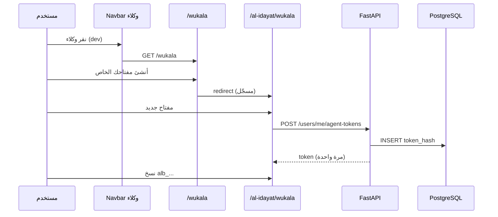

# تصميم: واجهة الوكلاء (MCP) — Navbar، شرح، ومفاتيح الوكيل

**التاريخ:** 2026-08-23  
**النطاق:** واجهة تطويرية (`DEV_MODE`) + API إدارة مفاتيح الوكيل — **بدون** خادم MCP ولا مصادقة بالمفتاح بعد.  
**مرجع أفكار المشروع:** `docs/afkar-al-mashrou.md` — القسم 5 (الجلسة المشتركة).

---

## 1. المشكلة والهدف

المستخدمون سيستخدمون وكلاء ذكية (Cursor، Claude Desktop، …) للتفاعل مع منصة البيان عبر MCP. قبل بناء خادم MCP الكامل، نحتاج:

1. **نقطة دخول واضحة** في الواجهة (زر «وكلاء» في Navbar — dev فقط).
2. **صفحة شرح** تشرح MCP وأسلوب الربط (كما تفعل Stripe/GitHub/Cursor).
3. **إدارة مفاتيح وكيل شخصية** — إنشاء، نسخ (مرة واحدة)، تعديل التسمية، حذف — مع API حقيقي في الخلفية.

**خارج النطاق (مؤجَّل):**

- خادم MCP (`mcp-server/`)
- مصادقة الطلبات عبر Agent Token في middleware
- طبقة `session/document.json` (الجلسة المشتركة)
- أدوات MCP (tools/resources/prompts)
- OAuth 2.1 للوكلاء

---

## 2. قرارات التصميم (معتمدة من المستخدم)

| # | القرار |
|---|--------|
| 1 | **الكل خلف dev mode:** `NEXT_PUBLIC_DEV_MODE=true` (واجهة) و`DEV_MODE=true` (خلفية) — وإلا إعادة توجيه `/` (واجهة) أو 404 (API). |
| 2 | صفحة الشرح: **`/wukala`** — **عامة** في dev mode؛ زر «أنشئ مفتاحك الخاص» يوجّه مسجّل → `/al-idayat/wukala`، غير مسجّل → `/tawajjuh?next=/al-idayat/wukala`. |
| 3 | إدارة المفاتيح: **`/al-idayat/wukala`** — فرعية تحت الإعدادات؛ تتطلب تسجيل دخول (محمية عبر `/al-idayat(.*)`). |
| 4 | بطاقة في **`/al-idayat`** (dev فقط) تربط بصفحة المفاتيح. |
| 5 | **واجهة + API** في نفس المهمة — لا mock في المتصفح. |
| 6 | المقاربة المعمارية: **API مفاتيح فقط** — لا middleware مصادقة بالمفتاح في هذه المرحلة. |

---

## 3. مسارات Frontend

```text
/wukala                    شرح MCP + CTA (عامة، DevModeGate)
/al-idayat/wukala          إدارة مفاتيح الوكيل (محمية + DevModeGate)
```

### Navbar (dev فقط)

- مكوّن `AgentsNavLink` في `MainNav` بعد رابط «التواصل».
- يظهر فقط عند `isDevMode()` (`frontend/src/lib/dev-mode.ts`).
- يوجّه إلى `/wukala`.
- نص: **وكلاء** + أيقونة `+` + حركات CSS احترافية (انظر §6).

### DevModeGate

مكوّن عميل `DevModeGate` يلف صفحات `/wukala` و`/al-idayat/wukala`:

- إن `!isDevMode()` → `redirect('/')` (Next.js `redirect` من Server Component أو `useRouter` في client layout).
- يُستخدم في `layout.tsx` لكل مسار أو layout مشترك `app/(dev-agents)/`.

### بطاقة في `/al-idayat`

- تظهر فقط عند `isDevMode()`.
- عنوان: «مفاتيح الوكلاء»
- وصف قصير + رابط «إدارة المفاتيح» → `/al-idayat/wukala`
- تنسيق: نفس `cardClassName` / بطاقات الإعدادات الحالية.

---

## 4. صفحة `/wukala` — محتوى وهيكل

### أقسام الصفحة (RTL، أسلوب مجلة البيان)

| # | القسم | المحتوى |
|---|--------|---------|
| 1 | Hero | عنوان: «اربط وكيلك الذكي بمجلة البيان» + جملة فرعية عن الكتابة بمساعدة الوكيل |
| 2 | ما هو MCP؟ | Model Context Protocol — بروتوكول يربط الوكيل بتطبيقاتك بأمان |
| 3 | كيف يعمل؟ | 3 خطوات مرقّمة: (١) إنشاء مفتاح (٢) إضافة الخادم في Cursor (٣) الكتابة — المستخدم يحفظ ويقدّم يدوياً |
| 4 | ماذا يفعل الوكيل؟ | قراءة المقالات، الكتابة في مسودة الجلسة (مستقبلاً)، مسودة مراجعة |
| 5 | ماذا لا يفعل؟ | لا تقديم مقال، لا إرسال مراجعة، لا قرارات تحريرية |
| 6 | CTA | زر أساسي: **«أنشئ مفتاحك الخاص»** — سلوك حسب Clerk |
| 7 | إعداد Cursor | كتلة `pre` قابلة للنسخ — مثال JSON لـ `mcpServers` (عنوان placeholder + `ALBAYAN_AGENT_TOKEN`) |

### CTA — منطق التوجيه

```ts
if (signedIn) router.push("/al-idayat/wukala");
else router.push("/tawajjuh?next=/al-idayat/wukala");
```

استخدام `useAuth` من Clerk في مكوّن عميل للزر.

---

## 5. صفحة `/al-idayat/wukala` — إدارة المفاتيح

### التخطيط

- رأس: «مفاتيح الوكلاء» + `← العودة إلى الإعدادات` → `/al-idayat`
- زر «مفتاح جديد» يفتح `ConfirmDialog` أو modal مخصص
- قائمة بطاقات — `EmptyState` إن لا مفاتيح

### بطاقة مفتاح (قراءة)

| حقل | عرض |
|-----|-----|
| `label` | عنوان البطاقة |
| `scopes` | شارات (badges) |
| `created_at` | تاريخ الإنشاء (تنسيق عربي عبر `formatDate`) |
| `last_used_at` | «لم يُستخدم بعد» أو التاريخ |
| إجراءات | تعديل التسمية · حذف |

### إنشاء مفتاح (modal)

**حقول:**

- `label` (مطلوب، max 100)
- `scopes` — checkboxes من القائمة البيضاء (انظر §7)

**بعد النجاح:**

- modal ثانٍ أو نفس modal يعرض `token` كاملاً **مرة واحدة** (`alb_...`)
- زر «نسخ»
- تحذير: «لن نعرض هذا المفتاح مرة أخرى»
- إغلاق → العودة للقائمة

### تعديل

- modal: `label` فقط
- `PATCH /api/v1/users/me/agent-tokens/{id}`

### حذف

- `ConfirmDialog` عربي
- `DELETE /api/v1/users/me/agent-tokens/{id}`

### حدود UX

- حد 5 مفاتيح نشطة — عند المحاولة السادسة رسالة خطأ من API
- تعطيل «مفتاح جديد» عند الوصول للحد

---

## 6. زر Navbar «وكلاء» — الحركة والشكل

**مكوّن:** `frontend/src/components/agents-nav-link.tsx`

**الشكل:**

```text
[ + ]  وكلاء   [DEV]
```

- `inline-flex`, `rounded-full` أو `rounded-md`
- حدود `border-emerald-500/40` أو `var(--journal-accent)`
- خلفية `bg-emerald-50/80` مع تدرج خفيف

**الحركات (CSS في `globals.css` — class `agents-nav-link`):**

| تأثير | التفاصيل |
|-------|----------|
| `agents-glow` | `box-shadow` نابض 3s `ease-in-out` infinite |
| `agents-plus-spin` | أيقونة `+` تدور 360° في 8s linear infinite |
| `agents-shimmer` | `background-position` على gradient شفاف |
| `:hover` | إيقاف الدوران (`animation-play-state: paused`) + تقوية الظل |
| `@media (prefers-reduced-motion: reduce)` | إلغاء كل animations |

**لا hover مطلوب للفت الانتباه** — الحركة تعمل دائماً (مع احترام reduced-motion).

---

## 7. API الخلفية

### جدول `agent_tokens`

| عمود | نوع | ملاحظات |
|------|-----|---------|
| `id` | UUID PK | |
| `user_id` | UUID FK → `users.id` | ON DELETE CASCADE |
| `token_hash` | VARCHAR(64) | SHA-256 hex |
| `label` | VARCHAR(100) | |
| `scopes` | JSON / ARRAY | قائمة نصوص |
| `expires_at` | TIMESTAMPTZ nullable | null = بلا انتهاء (v1) |
| `last_used_at` | TIMESTAMPTZ nullable | |
| `revoked_at` | TIMESTAMPTZ nullable | |
| `created_at` | TIMESTAMPTZ | |
| `updated_at` | TIMESTAMPTZ | |

**فهرس:** `ix_agent_tokens_user_id`

### Scopes البيضاء (v1)

```text
profile:read
articles:read
articles:session:write
reviews:read
reviews:draft:write
editor:read
```

الافتراضي عند الإنشاء من الواجهة: `profile:read`, `articles:read`, `articles:session:write`.

### توليد المفتاح

```text
alb_ + base64url(32 random bytes)  → يُخزَّن hash فقط
```

### Endpoints

**البادئة:** `/api/v1/users/me/agent-tokens`  
**المصادقة:** `AuthDep` (Clerk JWT)  
**الحماية:** `if not settings.dev_mode: raise HTTPException(404)`

| Method | Path | Body | Response |
|--------|------|------|----------|
| GET | `/api/v1/users/me/agent-tokens` | — | `list[AgentTokenRead]` — بدون secret |
| POST | `/api/v1/users/me/agent-tokens` | `{ label, scopes? }` | `AgentTokenCreated` — يتضمن `token` مرة واحدة |
| PATCH | `/api/v1/users/me/agent-tokens/{id}` | `{ label }` | `AgentTokenRead` |
| DELETE | `/api/v1/users/me/agent-tokens/{id}` | — | 204 |

**قواعد:**

- المفتاح يخص `current_user` فقط — غيره 404
- حد 5 مفاتيح غير ملغاة (`revoked_at IS NULL`) لكل مستخدم — 409 عند التجاوز
- التحقق من `scopes` ⊆ القائمة البيضاء — 400

### ملفات Backend المقترحة

```text
backend/app/models/agent_token.py
backend/app/schemas/agent_token.py
backend/app/services/agent_token_service.py
backend/app/routers/agent_tokens.py   # أو دمج في users.py
backend/alembic/versions/007_add_agent_tokens_table.py
```

تسجيل الراوتر في `main.py`.

### Frontend API

`frontend/src/lib/api/agent-tokens.ts` — دوال تستدعي `apiFetch` بنفس نمط `articles.ts`.

---

## 8. تدفق البيانات



---

## 9. معالجة الأخطاء

| الحالة | الواجهة | API |
|--------|---------|-----|
| dev mode معطّل | redirect `/` | 404 |
| غير مسجّل على `/al-idayat/wukala` | Clerk → `/tawajjuh` | 401 |
| 5 مفاتيح | رسالة عربية | 409 |
| scope غير صالح | رسالة تحقق | 400 |
| مفتاح غير موجود | — | 404 |

---

## 10. الاختبار والتحقق

| اختبار | الأمر/الإجراء |
|--------|----------------|
| lint | `cd frontend && npm run lint` |
| build | `cd frontend && npm run build` |
| migration | `alembic upgrade head` |
| يدوي | `NEXT_PUBLIC_DEV_MODE=true` — ظهور الزر، `/wukala`، إنشاء/نسخ/حذف مفتاح |
| يدوي | بدون dev mode — redirect من `/wukala`، API 404 |

---

## 11. خطة الملفات (تنفيذ لاحق)

### Frontend

| ملف | إجراء |
|-----|--------|
| `components/agents-nav-link.tsx` | جديد |
| `components/dev-mode-gate.tsx` | جديد |
| `components/settings/agent-tokens-panel.tsx` | جديد |
| `app/wukala/page.tsx` | جديد |
| `app/wukala/layout.tsx` | DevModeGate |
| `app/al-idayat/wukala/page.tsx` | جديد |
| `app/al-idayat/page.tsx` | بطاقة dev |
| `components/main-nav.tsx` | إضافة AgentsNavLink |
| `app/globals.css` | animations |
| `lib/api/agent-tokens.ts` | جديد |

### Backend

| ملف | إجراء |
|-----|--------|
| `models/agent_token.py` | جديد |
| `schemas/agent_token.py` | جديد |
| `services/agent_token_service.py` | جديد |
| `routers/agent_tokens.py` | جديد |
| `alembic/versions/007_...` | جديد |
| `main.py` | تسجيل router |
| `models/__init__.py` | استيراد AgentToken |

---

## 12. مراجعة ذاتية للمواصفة

- [x] لا TBD — المسارات والـ API محددة
- [x] متسق مع `afkar-al-mashrou.md` (scopes، بادئة `alb_`، لا submit من وكيل)
- [x] نطاق مركز — UI + token CRUD فقط
- [x] dev mode مزدوج (frontend redirect + backend 404)

---

*الخطوة التالية بعد موافقة المستخدم على هذه المواصفة: خطة تنفيذ تفصيلية (writing-plans).*
