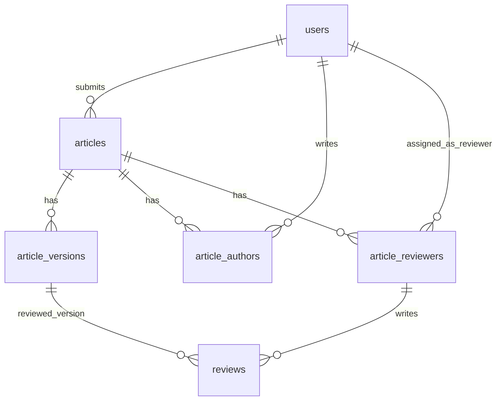

# مخطط قاعدة بيانات مجلة البيان

المرجع الرئيسي لتصميم قاعدة البيانات في منصة **البيان** — إدارة المقالات العلمية، الإصدارات، التأليف، والتحكيم.

---

## 1. مقدمة

المنصة تدير دورة حياة المقال العلمي من المسودة حتى النشر. المستخدمون يُعرَّفون عبر Clerk ويُخزَّن ملفهم في PostgreSQL. المقالات لها إصدارات متعددة (بعد ملاحظات المراجعين)، والمؤلفون والمراجعون يُربَطون بكل مقال على حدة.

**نطاق هذا المستند:** الجداول الستة الحالية والعلاقات بينها. لا يشمل واجهات API أو رفع S3 أو worker التجميع (موصوفة كسياق مستقبلي فقط).

---

## 2. قرارات التصميم

| # | القرار |
|---|--------|
| 1 | **لا `roles` / `user_roles`** — الإدارة عبر `users.is_admin` في البداية |
| 2 | **`articles` ≠ النسخة** — الإصدارات في `article_versions` (v1, v2, v3…) |
| 3 | **لا `current_version_id`** — النسخة الحالية تُستخرج بـ `ORDER BY version_number DESC LIMIT 1` |
| 4 | **المؤلفون** في `article_authors` مع `author_order` و`is_corresponding` |
| 5 | **المراجعون** في `article_reviewers` — التعيين وحالة الدعوة |
| 6 | **نص المراجعة** في `reviews` منفصل عن `article_reviewers` |
| 7 | **`reviews.article_reviewer_id`** → `article_reviewers.id` (وليس مباشرة إلى `users`) |
| 8 | **`reviews.article_version_id`** — المراجعة مرتبطة بنسخة محددة |
| 9 | **ملفات LaTeX** — `storage_prefix` فقط؛ داخل S3: `source.zip`, `compiled.pdf`, `manifest.json` |
| 10 | **المصدر الأساسي** — `source.zip` (من `zip_upload` أو `web_editor` لاحقاً) |
| 11 | **Worker** — معالجة ZIP/PDF خارج قاعدة البيانات؛ `compile_status` على الإصدار |
| 12 | **المستخدم مؤلف/مراجع** فقط عند وجوده في جداول الربط المناسبة |

---

## 3. مخطط العلاقات (ER)



**مسار بيانات المراجعة:**

```text
reviews → article_reviewers → users
reviews → article_versions → articles
```

---

## 4. الجداول

### 4.1 `users`

الأشخاص المسجّلون (مزامنة مع Clerk).

| العمود | النوع | ملاحظات |
|--------|--------|---------|
| `id` | UUID PK | |
| `clerk_id` | string, unique | معرّف Clerk |
| `email` | string | |
| `full_name` | string, nullable | |
| `affiliation` | string, nullable | الجهة/الجامعة |
| `bio` | text, nullable | |
| `is_admin` | boolean | default `false` — صلاحيات إدارية بسيطة |
| `created_at` | timestamptz | |
| `updated_at` | timestamptz | |

**فهارس:** `ix_users_clerk_id` (unique), `ix_users_email`

---

### 4.2 `articles`

المقال ككيان عام (ليس نسخة واحدة).

| العمود | النوع | ملاحظات |
|--------|--------|---------|
| `id` | UUID PK | |
| `submitted_by` | UUID FK → `users.id` | RESTRICT |
| `title` | string(500) | |
| `abstract` | text, nullable | |
| `status` | enum | حالة سير العمل (انظر §5) |
| `created_at` | timestamptz | |
| `updated_at` | timestamptz | |

**فهارس:** `ix_articles_submitted_by`, `ix_articles_status`

---

### 4.3 `article_versions`

نسخ المقال (v1 بعد التقديم، v2 بعد التعديل، …).

| العمود | النوع | ملاحظات |
|--------|--------|---------|
| `id` | UUID PK | |
| `article_id` | UUID FK → `articles.id` | CASCADE |
| `version_number` | integer | 1, 2, 3… |
| `storage_prefix` | string(500) | بادئة S3، مثال: `articles/{id}/versions/v1/` |
| `source_type` | enum | `zip_upload` \| `web_editor` |
| `compile_status` | enum | `pending` \| `processing` \| `success` \| `failed` |
| `change_summary` | text, nullable | وصف التعديل عن النسخة السابقة |
| `submitted_at` | timestamptz, nullable | تاريخ تقديم هذه النسخة |
| `created_at` | timestamptz | |

**قيود:** UNIQUE `(article_id, version_number)`

**فهرس:** `ix_article_versions_article_id`

**النسخة الحالية:**

```sql
SELECT * FROM article_versions
WHERE article_id = :article_id
ORDER BY version_number DESC
LIMIT 1;
```

---

### 4.4 `article_authors`

ربط many-to-many بين المقالات والمؤلفين.

| العمود | النوع | ملاحظات |
|--------|--------|---------|
| `article_id` | UUID FK → `articles.id` | CASCADE — جزء من PK |
| `user_id` | UUID FK → `users.id` | CASCADE — جزء من PK |
| `author_order` | integer | ترتيب الظهور (1 = الأول) |
| `is_corresponding` | boolean | المؤلف المراسل |

**PK:** `(article_id, user_id)`

---

### 4.5 `article_reviewers`

تعيين مراجع لمقال وحالة الدعوة.

| العمود | النوع | ملاحظات |
|--------|--------|---------|
| `id` | UUID PK | مطلوب لربط `reviews` |
| `article_id` | UUID FK → `articles.id` | CASCADE |
| `user_id` | UUID FK → `users.id` | RESTRICT |
| `status` | enum | `invited` \| `accepted` \| `declined` \| `completed` |
| `invited_at` | timestamptz | |
| `accepted_at` | timestamptz, nullable | |
| `declined_at` | timestamptz, nullable | |
| `created_at` | timestamptz | |
| `updated_at` | timestamptz | |

**قيود:** UNIQUE `(article_id, user_id)` — مراجع واحد لكل مقال

**فهارس:** `ix_article_reviewers_article_id`, `ix_article_reviewers_user_id`

---

### 4.6 `reviews`

نص المراجعة وتوصيتها — مرتبط بتعيين مراجع **ونسخة محددة**.

| العمود | النوع | ملاحظات |
|--------|--------|---------|
| `id` | UUID PK | |
| `article_reviewer_id` | UUID FK → `article_reviewers.id` | CASCADE |
| `article_version_id` | UUID FK → `article_versions.id` | RESTRICT |
| `comments_to_author` | text, nullable | ملاحظات للمؤلف |
| `comments_to_editor` | text, nullable | ملاحظات سرية للمحرر |
| `recommendation` | enum, nullable | `accept` \| `minor_revision` \| `major_revision` \| `reject` |
| `status` | enum | `draft` \| `submitted` |
| `submitted_at` | timestamptz, nullable | |
| `created_at` | timestamptz | |
| `updated_at` | timestamptz | |

**فهارس:** `ix_reviews_article_reviewer_id`, `ix_reviews_article_version_id`

---

## 5. التعدادات (Enums)

### `ArticleStatus` — حالة المقال

| القيمة | المعنى |
|--------|--------|
| `draft` | مسودة |
| `submitted` | مُقدَّم |
| `under_review` | قيد المراجعة |
| `accepted` | مقبول |
| `rejected` | مرفوض |
| `published` | منشور |

### `ReviewerAssignmentStatus` — حالة تعيين المراجع

| القيمة | المعنى |
|--------|--------|
| `invited` | دُعي |
| `accepted` | قبل المراجعة |
| `declined` | رفض الدعوة |
| `completed` | أنهى المراجعة |

### `SourceType` — مصدر النسخة

| القيمة | المعنى |
|--------|--------|
| `zip_upload` | رفع ملف ZIP |
| `web_editor` | محرر LaTeX داخل الموقع (لاحقاً) |

### `CompileStatus` — حالة تجميع PDF

| القيمة | المعنى |
|--------|--------|
| `pending` | في الانتظار |
| `processing` | قيد المعالجة |
| `success` | نجح التجميع |
| `failed` | فشل التجميع |

### `ReviewRecommendation` — توصية المراجع

| القيمة | المعنى |
|--------|--------|
| `accept` | قبول |
| `minor_revision` | تعديلات طفيفة |
| `major_revision` | تعديلات جوهرية |
| `reject` | رفض |

### `ReviewStatus` — حالة تقرير المراجعة

| القيمة | المعنى |
|--------|--------|
| `draft` | مسودة |
| `submitted` | مُسلَّم |

---

## 6. سيناريوهات شائعة

### إنشاء مقال جديد (إصدار أول)

```text
1. INSERT INTO articles (submitted_by, title, abstract, status='draft')
2. INSERT INTO article_versions (article_id, version_number=1, storage_prefix, compile_status='pending')
3. INSERT INTO article_authors (article_id, user_id, author_order=1, is_corresponding=true)
```

بدون `UPDATE` إضافي وبدون علاقة دائرية.

### رفع نسخة جديدة بعد ملاحظات المراجع

```text
1. SELECT MAX(version_number) + 1 FROM article_versions WHERE article_id = :id
2. INSERT INTO article_versions (..., version_number=N, change_summary='...')
3. رفع source.zip إلى storage_prefix الجديد
4. compile_status = 'pending' → worker يعالج لاحقاً
```

### تعيين مراجع

```text
INSERT INTO article_reviewers (article_id, user_id, status='invited')
```

### تسليم مراجعة

```text
INSERT INTO reviews (article_reviewer_id, article_version_id, comments_to_author, recommendation, status='submitted', submitted_at=now())
UPDATE article_reviewers SET status='completed' WHERE id = :assignment_id
```

---

## 7. تخزين الملفات (S3)

كل إصدار يملك `storage_prefix` واحداً، مثال:

```text
articles/550e8400-e29b-41d4-a716-446655440000/versions/v1/
```

محتويات المجلد المتوقعة:

```text
source.zip      — مشروع LaTeX مضغوط (المصدر الأساسي)
compiled.pdf    — PDF الناتج بعد التجميع
manifest.json   — بيانات وصفية (اختياري لاحقاً)
```

لا تُخزَّن مسارات متعددة في قاعدة البيانات — فقط `storage_prefix`.

---

## 8. سير Worker المستقبلي (خارج DB)

```text
رفع source.zip → حفظ في S3 تحت storage_prefix
إنشاء article_version بـ compile_status = pending
worker يفك ZIP → يجمع LaTeX → يرفع compiled.pdf
تحديث compile_status = success | failed
```

يُنفَّذ لاحقاً في container منفصل لأمان تجميع LaTeX.

---

## 9. استعلامات مفيدة

**النسخة الحالية لمقال:**

```sql
SELECT * FROM article_versions
WHERE article_id = :article_id
ORDER BY version_number DESC
LIMIT 1;
```

**مقالات المستخدم كمؤلف:**

```sql
SELECT a.* FROM articles a
JOIN article_authors aa ON aa.article_id = a.id
WHERE aa.user_id = :user_id;
```

**مقالات المستخدم كمراجع:**

```sql
SELECT a.* FROM articles a
JOIN article_reviewers ar ON ar.article_id = a.id
WHERE ar.user_id = :user_id;
```

**مراجعات نسخة معينة:**

```sql
SELECT r.* FROM reviews r
WHERE r.article_version_id = :version_id;
```

---

## 10. ما هو مؤجّل

- `roles` / `user_roles`
- `current_version_id`, `accepted_version_id`, `published_version_id`
- `review_rounds`, `editor_decisions`, `article_files`
- رفع S3 فعلي وworker التجميع
- endpoints API للمقالات

---

## 11. ترحيلات Alembic

| Revision | الوصف |
|----------|--------|
| `001_create_users` | جدول `users` |
| `002_create_articles` | `is_admin` + جداول المقالات الخمسة |

تشغيل:

```bash
cd backend
alembic upgrade head
```

النماذج: `backend/app/models/` — `user.py`, `article.py`, `enums.py`
