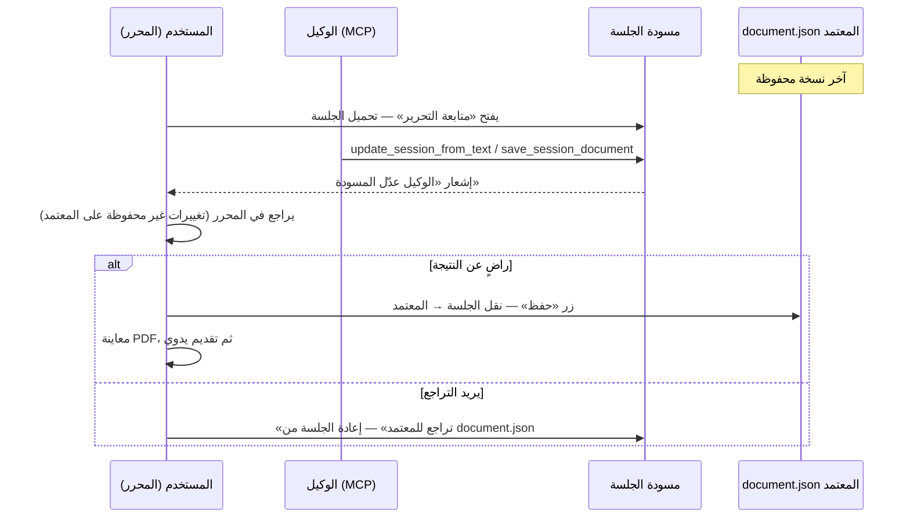

# توثيق MCP — مجلة البيان

> **الغرض:** مرجع موحّد لخادم MCP (Model Context Protocol) والتفاعل مع المنصة عبر الوكلاء الذكية.  
> **آخر تحديث:** ٢٥ أغسطس ٢٠٢٦  
> **الموقع:** `mcp_server/` في جذر المستودع  
> **مرجع سابق:** نُقل من `docs/afkar-al-mashrou.md` — القسم ٥.

---

## البنية الحالية (Current Architecture)

`mcp_server/` **محوّل رفيع (thin adapter)** فوق FastAPI فقط:

- كل أدوات MCP تستدعي `GET/POST /api/v1/...` عبر `api_client.py` مع تمرير credential المستخدم كما هو (`alb_...` أو Clerk OAuth JWT).
- **FastAPI** هو المسؤول النهائي عن: المصادقة، التفويض، منطق الأعمال، الملكية، حدود workflow، والوصول إلى قاعدة البيانات.
- **ممنوع** داخل `mcp_server/`: اتصال DB مباشر، استيراد نماذج SQLAlchemy، الوصول المباشر إلى S3، أو تكرار business logic.

```text
عميل AI → mcp_server (بروتوكول MCP فقط)
              │  Authorization: Bearer <credential>
              ▼
          FastAPI /api/v1/...  ← المصدر الوحيد للحقيقة
```

### النشر على Railway (بدون Dockerfile)

| الإعداد | القيمة |
|---------|--------|
| Root Directory | `mcp_server` |
| Builder | Nixpacks (تلقائي من `pyproject.toml`) |
| Start Command | `python -m albayan_mcp --transport streamable-http --host 0.0.0.0` |
| `PORT` | يحقنه Railway تلقائياً |

للتشغيل المحلي انسخ `mcp_server/.env.example` إلى `mcp_server/.env` وعدّل `ALBAYAN_API_URL` و`ALBAYAN_AGENT_TOKEN`.

---

## القدرات المنفذة حالياً (Current Implemented Capabilities)

> **التفعيل:** `NEXT_PUBLIC_MCP_ENABLED=true` (واجهة) + `MCP_ENABLED=true` (خلفية) + `alembic upgrade head`.

### الواجهة (Next.js)

| المكوّن / المسار | الوظيفة |
|------------------|---------|
| `AgentsNavLink` في `MainNav` | زر **«وكلاء»** في الهيدر (dev فقط) |
| `DevModeGate` / `McpGate` | إعادة توجيه `/` إن لم تكن MCP مفعّلة |
| `/wukala` | صفحة شرح MCP + مثال إعداد Cursor |
| `/al-idayat/wukala` | إدارة مفاتيح الوكيل (محمية — تسجيل دخول) |
| `DevModeAgentsCard` في `/al-idayat` | بطاقة رابط سريع لمفاتيح الوكلاء |
| `AgentTokensPanel` | إنشاء، نسخ (مرة واحدة)، تعديل التسمية، حذف |
| `frontend/src/lib/api/agent-tokens.ts` | عميل API للمفاتيح |
| `frontend/src/lib/agent-token-config.ts` | نطاقات الصلاحيات (scopes) والحد الأقصى (٥ مفاتيح) |

### الخلفية (FastAPI)

| المكوّن | الوظيفة |
|---------|---------|
| `GET/POST/PATCH/DELETE /api/v1/users/me/agent-tokens` | CRUD مفاتيح الوكيل |
| `agent_token_service.py` | إنشاء مفتاح `alb_...`، تخزين SHA-256 فقط، إلغاء، تحديث |
| `ActorDep` في `backend/app/core/actor.py` | هوية موحدة لمسارات human-or-agent الآمنة |
| `GET /api/v1/users/me` | Agent-safe: قراءة الملف الشخصي |
| `GET /api/v1/articles/me` | Agent-safe: قراءة مقالات المستخدم |
| `AuthDep` | يبقى مسار المصادقة البشري فقط لمسارات submit/review/editor/admin |

### خادم MCP

| المكوّن | الحالة |
|---------|--------|
| stdio transport | منجز |
| Streamable HTTP transport | منجز |
| `api_client.py` | تمرير Bearer إلى FastAPI، معالجة HTTP مركزية، helpers للـ object/list |
| `tools/profile.py` | أداة `get_my_profile` |
| `tools/articles.py` | أداة `read_articles` |
| `server.py` | تركيب الخادم وتسجيل الأدوات فقط |

### قاعدة البيانات

| الجدول | الحقول الرئيسية |
|--------|-----------------|
| `agent_tokens` (migration `007_agent_tokens`) | `user_id`, `token_hash`, `label`, `scopes` (JSONB), `expires_at`, `last_used_at`, `revoked_at` |

### النطاقات (scopes) المعرّفة في الواجهة

- `profile:read` — قراءة الملف الشخصي
- `articles:read` — قراءة المقالات
- `articles:session:write` — كتابة مسودة الجلسة (مستقبلاً)
- `reviews:read` — قراءة تعيينات المراجعة
- `reviews:draft:write` — مسودة ملاحظات المراجعة
- `editor:read` — قراءة مقالات التحرير

---

## حد قدرات الوكيل (Agent Capability Boundary)

الوكلاء حالياً يقرأون فقط:

- `get_my_profile` → `GET /api/v1/users/me`
- `read_articles` → `GET /api/v1/articles/me`

القاعدة الثابتة:

> الوكيل قد يساعد في القراءة وعمليات مسودة/جلسة قابلة للمراجعة لاحقاً. الإجراءات المعتمدة والنهائية تبقى بشرية فقط.

Authoritative actions تبقى human-only داخل FastAPI، وليس فقط لأنها غير موجودة كأدوات MCP:

- تقديم المقال.
- إرسال المراجعة.
- اتخاذ قرار تحريري.
- النشر.
- إجراءات الإدارة.
- أي commit أو save يحول مسودة الجلسة إلى محتوى معتمد.

لا يكفي حذف أداة MCP مثل `submit_article`. يجب أن يبقى endpoint نفسه على `AuthDep` أو اعتماد بشري صريح، وألا يستخدم `ActorDep` إلا إذا صُنّف المسار بأنه agent-safe.

---

## البنية المخططة للكتابة والجلسات (Planned Writing/Session Architecture)

لم تُنفّذ بعد أدوات الكتابة أو طبقة الجلسة المشتركة. الاتجاه المعماري المعتمد عند إضافتها لاحقاً:

- الوكيل لا يكتب مباشرة إلى `document.json` المعتمد.
- الكتابة المستقبلية تستهدف `session/document.json` أو endpoint جلسة في FastAPI.
- المستخدم يراجع تغييرات الجلسة داخل المنصة.
- المستخدم وحده يعتمد الجلسة أو يقدّم المقال أو يرسل المراجعة.
- مراجعات المستقبل يمكن أن تسمح بمسودة مراجعة فقط، لا إرسال المراجعة.

---

## ملاحظات التصميم التاريخية (Historical Design Notes)

النص التالي منقول من دراسة ٢٢ أغسطس ٢٠٢٦. يحتوي أسماء أدوات ومسارات وحالات كانت مخططة أو تاريخية، مثل `list_my_articles` وبعض عبارات “لم يُنفَّذ بعد”. المرجع الحالي الموثوق هو الأقسام أعلاه؛ هذا القسم يحفظ سياق التصميم طويل المدى فقط.

## 1. خادم MCP — التفاعل مع المنصة عبر الوكلاء الذكية

> **الغرض:** تمكين مستخدمي المنصة من التفاعل مع «البيان» عبر وكلائهم الذكية (Cursor، Claude Desktop، وغيرهما) من خلال خادم **MCP** (Model Context Protocol).  
> **الحالة:** **جزئي** — واجهة مفاتيح الوكيل + API + جدول `agent_tokens` (فرع dev). خادم MCP والجلسة المشتركة لم يُنفَّذا بعد.  
> **تاريخ الدراسة:** ٢٢ أغسطس ٢٠٢٦

### 1.1 ملخص تنفيذي

منصة البيان لديها اليوم واجهة **Next.js** وخلفية **FastAPI** منظّمة جيداً (~٤٠ endpoint تحت `/api/v1/`)، مع مصادقة **Clerk** وأدوار (مؤلف، مراجع، محرر، مدير). هذا يجعلها **جاهزة تقنياً** لخادم MCP يغلّف الـ API الحالي دون إعادة بناء المنطق.

**قرار تصميم أساسي:** الاستعمال الرئيسي للوكلاء هو **الجلسة المشتركة** بين المستخدم (المستأجر/العميل) والوكيل — يعملان على **نفس مسودة الجلسة**؛ المستخدم يرى تغييرات الوكيل في سياق التحرير، يراجعها، يعدّل يدوياً، ثم **يحفظ ويعتمد** بنفسه. **التقديم** (مقال، مراجعة، قرار تحريري) يتم **يدوياً من المنصة فقط** — وليس عبر الوكيل.

**ما ينقص:** مسار مصادقة للوكلاء (middleware)، خادم MCP منفصل، **طبقة مسودة الجلسة المشتركة** (`session/document.json`)، مزامنة المحرر مع الجلسة، طبقة تجريد نصية لـ BuTeX، ومنع صريح لأدوات التقديم/الإرسال من MCP.

### 1.2 كيف يعمل التطبيق اليوم (سياق للتصميم)

#### مخطط عام

```text
المتصفح (Next.js + BuTeX)
    ↓  Authorization: Bearer <Clerk JWT>
FastAPI (/api/v1/*)
    ↓
PostgreSQL + S3 (document.json, assets, PDF) + مترجم LaTeX خارجي
```

#### الطبقات الرئيسية

| الطبقة | التقنية | ملاحظة |
|--------|---------|--------|
| الواجهة | Next.js 15، Clerk | لا يوجد BFF — المتصفح يتصل مباشرة بـ FastAPI |
| الخلفية | FastAPI، SQLAlchemy، Alembic | خدمات: article, review, editor, admin, compile, invitation |
| المصادقة | Clerk JWT | `authenticate_request` + `authorized_parties` محددة |
| الأدوار | مزيج | **admin** من Clerk `publicMetadata.role`؛ author/reviewer/editor من جداول الربط |
| المحتوى | BuTeX `document.json` في S3 | مقال واحد = ملف JSON واحد لكل إصدار |
| سير العمل | draft → submitted → under_review → accepted/rejected → published | المسودة فقط قابلة للتحرير |

#### نقاط مهمة لـ MCP

- المنصة ليست CRUD بسيطاً: التحرير يمر عبر `document.json` (BuTeX Document v2).
- **اليوم:** صفحة التحرير تحتفظ بالتغييرات في **ذاكرة المتصفح** فقط (`dirty`) حتى زر «حفظ» — الوكيل لا يمكنه المشاركة في هذه الحالة.
- التقديم يتطلب تطابق العنوان/الملخص مع المستند + تجميع PDF ناجح (`compile_status=success`).
- الصلاحيات تُفرض في الخلفية؛ الوصول غير المصرّح يُرجع **404** (وليس 403) لإخفاء وجود المورد.
- المسودة المجمّدة (`status != draft`) ترفض أي تعديل (409).

### 1.3 فلسفة الاستعمال — ماذا يفعل الوكيل وماذا يفعل المستخدم؟

| الدور | الوكيل (MCP) | المستخدم (المنصة — يدوياً) |
|------|--------------|----------------------------|
| **مؤلف** | كتابة وتحرير **مسودة الجلسة** المشتركة؛ قراءة المقال؛ طلب تجميع PDF للمعاينة | فتح المحرر، **مراجعة** ما كتبه الوكيل، تعديل يدوي، **حفظ** المعتمد، **تقديم** المقال |
| **مراجع** | قراءة المخطوطة (PDF/مستند)؛ صياغة **مسودة** ملاحظات المراجعة | مراجعة الملاحظات في صفحة المراجعة، تعديل، **إرسال** التقرير والتوصية |
| **محرر** | قراءة المقال والمراجعات (لاحقاً — مساعدة في الصياغة) | **قرار تحريري** من واجهة «تحريري» فقط |
| **مدير** | قراءة وإحصاءات (لاحقاً) | تعيين مراجعين، تجاوز قرارات، إلخ — من `/admin` |

**مبدأ ثابت:** الوكيل **مساعد كتابة وتحرير** — وليس منفّذ قرارات نهائية (تقديم، إرسال مراجعة، قبول/رفض).

### 1.4 الجلسة المشتركة — التصميم المعتمد

#### المشكلة في التصميم الحالي

```text
S3: document.json          ← المعتمد (ما يُجمَّع ويُقدَّم)
        ↓ تحميل
صفحة التحرير (React)       ← تغييرات في الذاكرة فقط (dirty) — غير مرئية للوكيل
        ↓ زر «حفظ»
PUT /document              ← استبدال كامل لـ document.json
```

إذا كتب الوكيل مباشرة على `document.json` (كما يفعل `PUT` اليوم): لا مراجعة قبل الاعتماد، وتعارض محتمل مع محرر مفتوح بتغييرات غير محفوظة.

#### الحل المعتمد: مسودة جلسة مشتركة (Session Draft)

```text
document.json              ← المعتمد (canonical) — يُحدَّث فقط بزر «حفظ» من المستخدم
session/document.json      ← مسودة الجلسة — يكتب فيها الوكيل والمستخدم معاً
session/meta.json          ← (اختياري) آخر تعديل، المصدر (agent|user)، revision
```



**ما نعنيه بـ «جلسة مشتركة»:**

- **ليس** بالضرورة تحريراً متزامناً حرفاً بحرف (مثل Google Docs) في المرحلة الأولى.
- **نعني:** مسودة عمل **واحدة على الخادم** يراها المحرر والوكيل؛ التغييرات تظهر للمستخدم في صفحة التحرير قبل أي اعتماد على `document.json`.
- الوكيل **لا يكتب أبداً** مباشرة على `document.json` المعتمد.

#### قواعد الجلسة

| القاعدة | السبب |
|---------|--------|
| الوكيل يكتب في `session/` فقط | المعتمد لا يتغير حتى يحفظ المستخدم |
| المحرر يحمّل `session/` إن وُجدت، وإلا ينسخ من `document.json` عند أول فتح | بداية جلسة نظيفة |
| زر «حفظ» ينقل `session` → `document.json` | حد الاعتماد = قرار المستخدم |
| زر «تراجع للمعتمد» يستبدل `session` من `document.json` | رجوع بعد أخطاء الوكيل |
| snapshot اختياري قبل كل «حفظ» | `snapshots/{timestamp}.json` للرجوع لاحقاً |
| إن كان المحرر `dirty` ووصل تحديث من الوكيل | تنبيه: «الوكيل عدّل الجلسة — إعادة تحميل؟» (لا دمج صامت) |
| التقديم (`submit`) | **من الواجهة فقط** — لا أداة MCP |

#### تخزين S3 المقترح (تحت `storage_prefix`)

```text
articles/{id}/versions/v{n}/
  document.json           ← معتمد
  session/
    document.json         ← جلسة مشتركة
    meta.json             ← revision, updated_by, updated_at
  snapshots/              ← (اختياري) قبل كل حفظ
    2026-08-23T12-00-00Z.json
  assets/*
  compiled.pdf
```

#### مزامنة المحرر (واجهة)

| المرحلة | الآلية |
|---------|--------|
| **أولى** | polling كل N ثوانٍ أثناء فتح `/tahrir` — إن تغيّر `session/meta.revision` → banner «تحديث من الوكيل» |
| **لاحقة** | WebSocket أو SSE لإشعار فوري |

تمييز بصري اختياري: كتل أُضيفت من الوكيل بلون خفيف (يتطلب توسيع BuTeX أو metadata على الكتل).

#### المراجع — جلسة أبسط

مسودة المراجعة **موجودة أصلاً على الخادم** (`reviews` — `comments_to_author`، إلخ). الوكيل يحدّث **مسودة المراجعة** فقط؛ المستخدم يفتح صفحة المراجعة، يراجع، **يرسل يدوياً**. لا حاجة لطبقة `session/` منفصلة على مستند BuTeX للمراجع.

### 1.5 ما هو MCP في سياقنا؟

خادم MCP يعرض على الوكيل الذكي ثلاثة أنواع من الواجهات:

| النوع | الغرض | مثال في البيان |
|-------|--------|----------------|
| **Tools** | إجراءات يستدعيها الوكيل | `update_session_from_text`، `save_review_draft` |
| **Resources** | بيانات للقراءة عبر URI | `albayan://articles/{id}/session` |
| **Prompts** | قوالب جاهزة | «ساعدني في صياغة ملخص المقال» |

المستخدم يضيف خادم MCP في إعدادات وكيله، فيصبح الوكيل قادراً على التفاعل مع المنصة **نيابة عنه** — بشرط أن يكون **مصادقاً كمستخدم حقيقي** وبنفس صلاحياته. كل كتابة للمقال تذهب إلى **مسودة الجلسة** حتى يعتمدها المستخدم في المحرر.

### 1.6 التوصية المعمارية

#### خادم MCP منفصل + API جلسة في الخلفية

```text
mcp_server/                    ← بروتوكول MCP (thin adapter → FastAPI)
    ↓ HTTP
backend FastAPI
    ├── /api/v1/articles/.../session   ← جديد: جلسة مشتركة
    ├── /api/v1/articles/.../document  ← معتمد (حفظ المستخدم فقط)
    └── ...
    ↓
PostgreSQL + S3 (document.json + session/ + snapshots/)
```

**لماذا منفصل وليس داخل FastAPI مباشرة؟**

- بروتوكول MCP (stdio / Streamable HTTP) مختلف عن REST.
- يمكن نشره على Railway كخدمة مستقلة.
- يعيد استخدام منطق الخدمات دون تكرار الصلاحيات.
- عزل أسهل: rate limiting، audit log، تعطيل MCP دون المساس بالواجهة.

#### ما لا ننصح به

1. فتح FastAPI بدون مصادقة للوكلاء.
2. إعطاء الوكيل وصول admin افتراضياً.
3. **`PUT /document` مباشرة من الوكيل** — يتجاوز مراجعة المستخدم.
4. أدوات `submit_article` / `submit_review` / `post_editor_decision` في MCP.
5. بناء MCP داخل Next.js (يجب أن يكون خدمة خلفية).
6. دمج صامت عند تعارض المحرر المحلي مع تحديث الوكيل.

### 1.7 المصادقة — مفاتيح وكيل شخصية (Personal Agent Tokens)

```text
المستخدم → صفحة في /al-idayat/wukala → «إنشاء مفتاح وكيل»
    ↓
يُنشأ token (يُعرض مرة واحدة) مرتبط بـ user_id + نطاق صلاحيات (scopes)
    ↓
المستخدم يضعه في إعدادات MCP client
    ↓
خادم MCP يتحقق منه ويمرّر Authorization إلى FastAPI
```

**جدول `agent_tokens` (مُنفَّذ):**

```sql
agent_tokens
  id            UUID PK
  user_id       UUID FK → users.id
  token_hash    varchar(64)    -- SHA-256 للمفتاح؛ لا يُخزَّن النص الصريح
  label         varchar(100)   -- مثال: «Cursor على جهازي»
  scopes        JSONB          -- انظر الجدول أدناه
  expires_at    timestamptz    -- nullable
  last_used_at  timestamptz
  revoked_at    timestamptz    -- nullable
  created_at    timestamptz
  updated_at    timestamptz
```

**النطاقات (scopes) المقترحة:**

| Scope | ماذا يسمح |
|-------|-----------|
| `profile:read` | قراءة الملف الشخصي |
| `articles:read` | قراءة مقالاتي، المعتمد، وجلسة التحرير |
| `articles:session:write` | كتابة **مسودة الجلسة** فقط (لا المعتمد) |
| `reviews:read` | قراءة تعيينات المراجعة والمخطوطة |
| `reviews:draft:write` | حفظ **مسودة** ملاحظات المراجعة (لا الإرسال) |
| `editor:read` | قراءة مقالات التحرير |
| `admin:read` | قراءة إدارية (لاحقاً) |

**ما لا يُمنح للوكيل (محظور بالتصميم — لا scope):**

| إجراء | السبب |
|-------|--------|
| `articles:submit` | التقديم يدوي من المنصة |
| `reviews:submit` | إرسال المراجعة يدوي |
| `editor:decision` | القرار التحريري يدوي |
| `admin:write` | إدارة المنصة يدوية |

**تعديل مطلوب في الخلفية (لاحقاً):**

- middleware يقبل إما Clerk JWT **أو** Agent Token.
- Agent Token يُحوَّل إلى `AuthContext` نفسه (`clerk_id` / `user_id`).
- التحقق من `scopes` قبل تنفيذ كل أداة MCP.
- endpoints الجلسة: `GET/PUT /articles/{id}/session` — الوكيل يستخدم PUT على الجلسة فقط.

#### لماذا ليس Clerk OAuth مباشرة في المرحلة الأولى؟

- OAuth 2.1 لـ MCP Remote موجود لكنه أعقد (authorization server، consent screen، token refresh).
- مفاتيح شخصية أبسط وأشبه بـ GitHub PAT — مناسبة لمرحلة تجريبية.
- يمكن إضافة OAuth لاحقاً للمستخدمين الذين لا يريدون نسخ مفاتيح يدوياً.

### 1.8 نقل البيانات (Transport)

| النمط | مناسب لـ | ملاحظة |
|-------|----------|--------|
| **stdio** | Cursor محلي، تطوير | المستخدم يشغّل الخادم على جهازه؛ الـ token في متغير بيئة |
| **Streamable HTTP** | إنتاج على Railway | المستخدمون يضيفون URL في إعدادات الوكيل |
| **SSE** | بديل قديم | MCP يتجه نحو HTTP |

**للإنتاج على Railway:** Streamable HTTP على مسار مثل `https://mcp.albayan-journal.org/mcp` مع HTTPS إلزامي.

**مثال إعداد في Cursor (محلي):**

```json
{
  "mcpServers": {
    "albayan": {
      "command": "python",
      "args": ["-m", "albayan_mcp"],
      "env": {
        "ALBAYAN_API_URL": "https://api.albayan-journal.org",
        "ALBAYAN_AGENT_TOKEN": "alb_xxxxxxxx"
      }
    }
  }
}
```

**مثال إعداد عن بُعد (إنتاج):**

```json
{
  "mcpServers": {
    "albayan": {
      "url": "https://mcp.albayan-journal.org/mcp",
      "headers": {
        "Authorization": "Bearer alb_xxxxxxxx"
      }
    }
  }
}
```

### 1.9 تصميم الأدوات (Tools) — مبني على الجلسة المشتركة

#### API جلسة جديد (خلفية — للمحرر والوكيل)

| Method | المسار | من يستخدمه | الوصف |
|--------|--------|------------|--------|
| `GET` | `/articles/{id}/session` | محرر + وكيل | قراءة مسودة الجلسة |
| `PUT` | `/articles/{id}/session` | وكيل (MCP) + محرر | تحديث مسودة الجلسة |
| `DELETE` | `/articles/{id}/session` | محرر (المستخدم) | تراجع — إعادة الجلسة من المعتمد |
| `POST` | `/articles/{id}/session/commit` | محرر (المستخدم فقط) | نقل الجلسة → `document.json` (= زر «حفظ») |
| `GET` | `/articles/{id}/session/meta` | محرر (polling) | `revision`، `updated_by`، `updated_at` |

`PUT /articles/{id}/document` يبقى **للمستخدم عبر المحرر** عند الاعتماد (أو يُستبدل بـ `session/commit`).

#### المرحلة 1 — قراءة

| Tool | يستدعي | الغرض |
|------|--------|--------|
| `get_my_profile` | `GET /users/me` | معلومات الحساب |
| `list_my_articles` | `GET /articles/me` | قائمة المقالات |
| `get_article` | `GET /articles/{id}` | تفاصيل + حالة |
| `get_article_document` | `GET /articles/{id}/document` | المحتوى **المعتمد** |
| `get_session_document` | `GET /articles/{id}/session` | مسودة **الجلسة** الحالية |
| `get_session_as_text` | تحويل محلي | نص الجلسة للوكيل |
| `list_my_reviews` | `GET /reviews/me` | تعيينات المراجعة |
| `get_review_assignment` | `GET /reviews/assignments/{id}` | تفاصيل تعيين |

#### المرحلة 2 — كتابة الجلسة (مؤلف)

| Tool | يستدعي | ملاحظة |
|------|--------|--------|
| `create_article` | `POST /articles` | إنشاء مقال + تهيئة جلسة فارغة |
| `update_article_metadata` | `PATCH /articles/{id}` | عنوان/ملخص — مسودة فقط |
| `update_session_from_text` | تحويل + `PUT /session` | **الأداة الرئيسية للكتابة** |
| `save_session_document` | `PUT /session` | JSON كامل — للمطورين بحذر |
| `upload_article_image` | `POST /assets` | صور تُستخدم في الجلسة |
| `request_compile` | `POST /compile` | يُجمّع من **المعتمد**؛ يذكّر المستخدم بالحفظ أولاً إن تغيّرت الجلسة |

**لا يوجد في MCP:** `submit_article`، `commit_session` (الاعتماد = حفظ المستخدم في المحرر).

#### المرحلة 3 — مراجع

| Tool | يستدعي | ملاحظة |
|------|--------|--------|
| `get_assignment_document` / PDF | قراءة | للمخطوطة |
| `save_review_draft` | `PUT .../review` | مسودة ملاحظات فقط |
| **محظور** | `POST .../review/submit` | الإرسال يدوي من المنصة |

#### ما لن يُضاف إلى MCP (قرار ثابت)

| إجراء | البديل |
|-------|--------|
| تقديم مقال | المستخدم: زر «تقديم» في `/maktabi/maqalati/{id}` |
| إرسال مراجعة | المستخدم: زر «إرسال» في `/maktabi/murajaati/{id}` |
| قرار تحريري | المستخدم: `/maktabi/tahriri/{id}` |
| إدارة admin | `/admin` فقط |

### 1.10 تحرير المحتوى — طبقة نصية على الجلسة

BuTeX Document v2 JSON معقد. الوكيل يتعامل مع **الجلسة** عبر نص مبسّط:

```text
get_session_as_text(article_id)       → قراءة ما في الجلسة
update_session_from_text(article_id, section?, text)  → كتابة في الجلسة
```

| مسار | الاستعمال |
|------|-----------|
| **نصي على الجلسة** | المسار الافتراضي للمؤلفين — يظهر في المحرر بعد المزامنة |
| **أدوات كتل** (`insert_paragraph`, …) | لاحقاً — تعديلات موضعية أدق |
| **JSON خام على الجلسة** | `save_session_document` — dev فقط |

**الفرق عن التصميم السابق:** كل الكتابة تستهدف `session/` — **ليس** `document.json` المعتمد.

### 1.11 Resources (للقراءة السريعة)

```
albayan://profile
albayan://articles
albayan://articles/{id}
albayan://articles/{id}/document          ← معتمد
albayan://articles/{id}/session           ← جلسة مشتركة
albayan://articles/{id}/session/meta      ← revision للمزامنة
albayan://articles/{id}/status
albayan://reviews/assignments/{id}
```

### 1.12 Prompts مفيدة (قوالب جاهزة)

| Prompt | الغرض |
|--------|--------|
| `draft-abstract` | صياغة ملخص (يُكتب في الجلسة أو metadata) |
| `continue-session` | متابعة الكتابة من `get_session_as_text` |
| `review-checklist` | قائمة تحقق للمراجع |
| `status-summary` | ملخص حالة مقالاتي |
| `remind-save` | تذكير المستخدم بالحفظ قبل التجميع/التقديم |

### 1.13 الأمان

| المخاطرة | الحل |
|----------|------|
| الوكيل يعتمد محتوى دون المستخدم | **لا** `commit` / `submit` من MCP؛ الجلسة ≠ المعتمد |
| تعارض محرر + وكيل | polling + تنبيه؛ لا دمج صامت |
| الوكيل يفسد JSON | الكتابة على الجلسة + «تراجع للمعتمد» |
| تسريب مسودة | سياسة 404 الحالية |
| token مسروق | انتهاء، إلغاء، scopes ضيقة (`session:write` لا `commit`) |
| إساءة استخدام | rate limit + audit log |
| رفع صور | نفس قيود MIME والحجم (٥ م.ب) |

**جدول audit log مقترح:**

```sql
mcp_audit_log
  id          UUID PK
  user_id     UUID FK → users.id
  token_id    UUID FK → agent_tokens.id (nullable)
  tool_name   varchar(100)
  target      varchar(50)     -- session | review_draft | ...
  args_hash   varchar(64)
  status      varchar(20)
  error_code  integer (nullable)
  ip_address  inet (nullable)
  created_at  timestamptz
```

### 1.14 هيكل مشروع MCP مقترح

```text
mcp_server/
└── src/albayan_mcp/
    ├── tools/
    │   ├── session.py          ← update_session_from_text، get_session_*
    │   ├── articles.py
    │   └── reviews.py
    ├── converters/
    │   └── document_text.py    # يعمل على جلسة، ليس معتمداً
    └── ...
```

**تعديلات الواجهة (frontend) المطلوبة:**

- `/tahrir`: تحميل من `/session`؛ polling على `/session/meta`.
- banner «الوكيل عدّل المسودة — إعادة تحميل؟».
- زر «حفظ» → `POST .../session/commit`.
- زر «تراجع للمعتمد» → `DELETE .../session`.

### 1.15 تجربة المستخدم — سيناريو الجلسة المشتركة

```text
1. المستخدم ينشئ مفتاح وكيل في /al-idayat/wukala ويضيفه في Cursor
2. يفتح مقالاً → «متابعة التحرير» (اختياري — يمكن أن يبدأ الوكيل أولاً)
3. في Cursor: «اكتب مقدمة للمقال X»
4. الوكيل: get_session_as_text → update_session_from_text → PUT /session
5. في المحرر (أو عند فتحه): «الوكيل عدّل المسودة» — يرى النص، يعدّل يدوياً
6. إن أخطأ الوكيل: «تراجع للمعتمد»
7. إن رضي: «حفظ» → session → document.json المعتمد
8. معاينة PDF، ثم «تقديم» يدوياً من صفحة المقال — ليس عبر الوكيل
```

**مراجع:** يقرأ الوكيل المخطوطة، يكتب `save_review_draft`؛ المستخدم يفتح مراجعاتي، يراجع، **يرسل** يدوياً.

### 1.16 ربط بـ API الحالي

| الدور | مسارات | عبر MCP |
|-------|--------|---------|
| مؤلف | `/articles/*/session`، `/document` (قراءة معتمد) | كتابة جلسة فقط |
| مراجع | `/reviews/*` | مسودة مراجعة فقط |
| محرر/مدير | قراءة لاحقاً | بدون قرارات من MCP |

### 1.17 خارطة تنفيذ مقترحة

| المرحلة | المحتوى | الحالة |
|---------|---------|--------|
| **0** | `agent_tokens` + واجهة إدارة المفاتيح | **منجز** (فرع dev) |
| **0b** | middleware مصادقة Agent Token | مخطّط |
| **1** | API الجلسة (`session/`) + تعديل المحرر (تحميل، commit، تراجع، polling) | مخطّط |
| **2** | MCP read-only + `get_session_*` | مخطّط |
| **3** | `update_session_from_text` + محوّل BuTeX ↔ نص | مخطّط |
| **4** | `save_review_draft` للمراجع | مخطّط |
| **5** | WebSocket/SSE + تمييز بصري لكتل الوكيل (اختياري) | مخطّط |
| **6** | OAuth 2.1 (اختياري) | لاحقاً |

### 1.18 أسئلة مفتوحة

1. فترة polling الافتراضية في المحرر (٣ ث؟ ٥ ث؟).
2. هل `request_compile` يُجمّع من الجلسة مباشرة (معاينة قبل الحفظ) أم من المعتمد فقط؟
3. حد أقصى لحجم `session/document.json` أو عدد revisions؟
4. واجهة محادثة داخل المنصة تستخدم نفس API الجلسة؟
5. snapshots تلقائية قبل كل commit — كم نسخة نحتفظ؟

### 1.19 الخلاصة

| جاهز اليوم | ينقص (مع الجلسة المشتركة) |
|------------|---------------------------|
| API مقالات ومراجع | طبقة `session/` في S3 + endpoints |
| محرر BuTeX | مزامنة مع الجلسة + commit/تراجع |
| مسودة مراجعة على الخادم | ربط MCP بـ `save_review_draft` فقط |
| واجهة + API مفاتيح الوكيل (`agent_tokens`) | middleware مصادقة بالمفتاح |
| | خادم MCP فعلي |
| | منع submit من الوكيل (تصميم، ليس فقط policy) |

**القرار المعتمد:** الجلسة المشتركة (مسودة جلسة على الخادم) هي نموذج التحرير الأساسي بين المستخدم والوكيل؛ الاعتماد والتقديم يبقيان في يد المستخدم على المنصة.

---

## سجل التحديثات

| التاريخ | التحديث |
|---------|---------|
| ٢٣/٠٨/٢٠٢٦ | إنشاء المجلد والملف؛ نقل توثيق MCP من `docs/afkar-al-mashrou.md` |
| ٢٣/٠٨/٢٠٢٦ | إضافة ملخص ما تم إنجازه (واجهة، خلفية، قاعدة بيانات) |
| ٢٥/٠٨/٢٠٢٦ | تحديث الحالة الحالية بعد Batch 1-3؛ إضافة حد قدرات الوكيل؛ ووسم التصميم القديم كتاريخي/مخطط |
